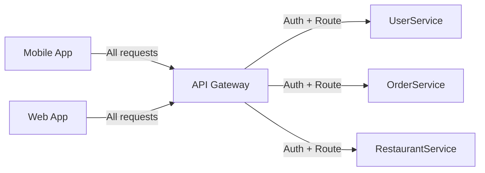

# API Gateway

> A server that sits between clients and your backend services, acting as the single entry point for all API requests.

Difficulty: 🟡 Intermediate
Time: 12 min
Prerequisites:
- [HTTP](../networking/http.md)
- Microservices (concept awareness helpful)

---

## Definition

An API Gateway is a reverse proxy that receives all incoming client requests and routes them to the appropriate backend service. It centralizes cross-cutting concerns — authentication, rate limiting, logging, and more — so individual services don't have to implement them independently.

---

## Why it Exists

In the early days of a product, you might have a single backend server. The mobile app calls it directly. The web frontend calls it directly. Life is simple.

Then the team grows. You split the backend into services: one for users, one for orders, one for payments. Now the client has a problem — it has to know about every service, make multiple calls to load a single screen, and handle different authentication mechanisms per service.

Without a gateway:

- Clients are tightly coupled to your internal service topology.
- Every service reimplements auth, rate limiting, and logging.
- Adding a new service means updating every client to know about it.
- Mobile apps can't be updated as fast as your backend changes.

The API Gateway exists to shield clients from that internal complexity and give you one place to enforce policies across all traffic.

---

## Intuition

Think of a hotel concierge. You walk in and tell the concierge what you need — a taxi, a restaurant reservation, your luggage carried up. You don't walk directly to the taxi dispatcher, the restaurant, or the porter. The concierge handles routing, knows who does what, and is your single point of contact.

The API Gateway is that concierge for your backend. Clients only ever talk to the gateway. The gateway knows how to reach each internal service and handles all the logistics in between.

---

## Engineering Story

A food delivery app has three separate backend services: `UserService`, `RestaurantService`, and `OrderService`. The mobile app needs to display a home screen showing the user's name, nearby restaurants, and active orders.

Without a gateway, the app makes three parallel requests:
- `GET users.internal.com/me`
- `GET restaurants.internal.com/nearby`
- `GET orders.internal.com/active`

Each service has its own auth logic. Each has its own domain. The app has to manage three connections and combine the results itself.

The team adds an API Gateway. Now the app makes one request: `GET api.example.com/home`. The gateway:

1. Authenticates the token once.
2. Fans out to all three services in parallel.
3. Aggregates the responses.
4. Returns a single payload to the app.

When `RestaurantService` is later split into `RestaurantService` and `SearchService`, the app doesn't need to change — the gateway absorbs the internal restructuring.

---

## How it Works

1. **Client sends a request** to the gateway's public endpoint (e.g., `api.example.com/orders`).

2. **Gateway applies policies** before the request reaches any service:
   - Validates the authentication token.
   - Checks rate limits for this client.
   - Logs the request for observability.

3. **Gateway routes the request** by matching the path, method, or headers to the appropriate backend service.

4. **Gateway optionally transforms the request** — rewriting headers, translating protocols (REST → gRPC), or aggregating multiple calls.

5. **Backend service processes the request** and returns a response to the gateway.

6. **Gateway returns the response** to the client, optionally transforming or enriching it (e.g., adding cache headers).

---

## Diagram



---

## What Gateways Actually Do

Not every gateway does everything. The features you get depend on the product you choose. These are the most common capabilities:

### Routing
Map incoming paths to backend services. `/api/users/*` goes to `UserService`, `/api/orders/*` goes to `OrderService`.

### Authentication & Authorization
Validate JWTs or API keys once at the gateway. Backend services can trust that traffic coming through the gateway is already authenticated.

### Rate Limiting
Enforce limits per client, per IP, or per API key. Protect your services from being overwhelmed without touching service code.

### Request Aggregation (BFF pattern)
Combine multiple service calls into a single response. Instead of the client making three round trips, the gateway does them server-side where latency is much lower.

### Protocol Translation
Translate REST calls to gRPC, or WebSocket traffic to HTTP/2. Clients use the protocol that's convenient for them; services use whatever is efficient internally.

### SSL Termination
Handle HTTPS at the gateway. Backend services communicate over plain HTTP inside your private network, simplifying certificate management.

### Caching
Cache responses for common requests so downstream services aren't hit repeatedly for the same data.

### Observability
Log every request and response, emit metrics, and attach trace IDs — all in one place, without touching service code.

---

## Implementation

Most teams don't build their own gateway. Common options:

| Option | Good for |
|---|---|
| **Kong** | Self-hosted, highly customizable, plugin ecosystem |
| **AWS API Gateway** | Serverless and Lambda integrations on AWS |
| **Nginx / Caddy** | Lightweight routing and SSL termination |
| **Traefik** | Kubernetes-native, auto-discovers services |
| **Apigee** | Enterprise teams needing full API management |
| **Envoy** | Low-level, used as the data plane in service meshes |

For simple setups, Nginx handles routing and SSL termination. For larger microservice architectures, Kong or a cloud-native gateway gives you the plugin ecosystem (auth, rate limiting, logging) without writing custom middleware.

---

## Code Example

A minimal gateway-like router in Node.js that shows the core idea — receiving a request, applying auth, then forwarding to the right service:

```javascript
const express = require("express");
const { createProxyMiddleware } = require("http-proxy-middleware");

const app = express();

// Auth middleware — runs before any route
function authenticate(req, res, next) {
  const token = req.headers["authorization"];
  if (!token || !isValidToken(token)) {
    return res.status(401).json({ error: "Unauthorized" });
  }
  next();
}

app.use(authenticate);

// Route /api/users/* → UserService
app.use(
  "/api/users",
  createProxyMiddleware({ target: "http://user-service:3001", changeOrigin: true })
);

// Route /api/orders/* → OrderService
app.use(
  "/api/orders",
  createProxyMiddleware({ target: "http://order-service:3002", changeOrigin: true })
);

app.listen(8080, () => console.log("Gateway running on :8080"));
```

This isn't production-grade, but it illustrates the essential pattern: all requests enter one place, auth is enforced once, and requests are proxied to the right service.

---

## Advantages

- **Clients stay simple.** The mobile app only needs to know one URL. It doesn't care how many services exist behind the gateway.
- **Cross-cutting concerns in one place.** Auth, rate limiting, logging, and CORS are configured once at the gateway instead of in every service.
- **Internal flexibility.** You can refactor, rename, or split backend services without changing client code. The gateway absorbs the change.
- **Better observability.** All traffic flows through one point, making it easy to see request rates, error rates, and latency across the entire system.
- **Security boundary.** Services don't need to be publicly accessible. Only the gateway is exposed to the internet.

---

## Limitations

- **Single point of failure.** If the gateway goes down, nothing works. You need to run it with high availability (multiple instances, load balanced).
- **Latency overhead.** Every request adds a network hop through the gateway. Usually negligible, but noticeable in latency-sensitive paths.
- **Can become a bottleneck.** All traffic flows through one layer. If the gateway is under-provisioned, it constrains the entire system.
- **Operational complexity.** Managing gateway configuration — especially routing rules and plugins — becomes its own discipline as the system grows.
- **Risk of over-centralization.** Teams sometimes push too much business logic into the gateway (transformation, enrichment, conditional routing). The gateway should handle infrastructure concerns, not business rules.

---

## Tradeoffs

### Gateway vs. Direct Service-to-Client Communication

A gateway adds a hop but simplifies clients and centralizes policy. Direct communication removes the hop but forces every service to handle auth, CORS, and rate limiting independently. For anything beyond a small monolith, a gateway pays for itself.

### Single Gateway vs. Multiple Gateways

A single gateway is simple to operate but becomes a shared dependency across teams. Large organizations often run separate gateways per product area or per client type (mobile gateway, partner API gateway). This maps well to the BFF (Backend for Frontend) pattern.

### Managed vs. Self-Hosted

Managed gateways (AWS API Gateway, Apigee) reduce operational burden but lock you into a cloud vendor. Self-hosted options (Kong, Nginx) give you more control but require your team to operate and scale them.

---

## Common Mistakes

- **Putting business logic in the gateway.** The gateway should handle infrastructure concerns — routing, auth, rate limiting. The moment you start writing "if user is premium, call this service" logic in the gateway, you've made it hard to test and maintain.
- **Forgetting high availability.** Teams run a single gateway instance and discover their single point of failure when it crashes. Always run at least two instances behind a load balancer.
- **Skipping request timeouts.** If a backend service hangs, the gateway will hold open connections until the client gives up. Set explicit timeouts at the gateway so slow services don't exhaust connection pools.
- **Not versioning your API.** The gateway is the right place to support `/v1/` and `/v2/` routing. Neglecting this early means painful migrations later.
- **Treating the gateway as a firewall.** A gateway is not a replacement for proper network-level security. Backend services should still validate inputs, even if they trust the gateway's auth.

---

## Related Concepts

- **[Reverse Proxy](../backend/reverse-proxy.md)** — An API Gateway is a reverse proxy with additional features. Understanding a basic reverse proxy helps clarify what the gateway adds on top.
- **[Load Balancer](../backend/load-balancer.md)** — Often confused with a gateway. A load balancer distributes traffic across identical instances of one service. A gateway routes traffic to different services.
- **BFF (Backend for Frontend)** — A pattern where each client type (mobile, web, partner) gets its own gateway tailored to its needs. A natural evolution of the single gateway.
- **Service Mesh** — Handles service-to-service communication (east-west traffic). A gateway handles client-to-service traffic (north-south). They complement each other and are often used together.

---

## Interview Questions

- **What is an API Gateway and what problems does it solve?** (Tests understanding of why it exists — not just what it is.)
- **What's the difference between an API Gateway and a load balancer?** (Tests ability to distinguish routing-to-services vs. distributing-across-instances.)
- **What are the risks of putting too much logic in an API Gateway?** (Tests understanding of the gateway's appropriate scope.)
- **How would you handle a gateway becoming a single point of failure?** (Tests operational thinking — redundancy, health checks, circuit breakers.)
- **When would you use multiple gateways instead of one?** (Tests understanding of the BFF pattern and team autonomy.)

---

## TLDR

- An API Gateway is the single entry point for all client requests — it routes, authenticates, and enforces policies before traffic reaches your services.
- It exists because clients shouldn't need to know your internal service topology.
- Cross-cutting concerns (auth, rate limiting, logging) live in the gateway — not in every service.
- Don't put business logic in the gateway; keep it focused on infrastructure concerns.
- Always run it with high availability — a down gateway means everything is down.
