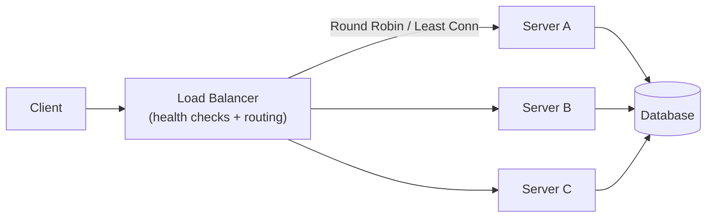

# Load Balancer

> A load balancer distributes incoming requests across multiple servers so no single server is overwhelmed.

Difficulty: 🟢 Beginner
Time: 12 min
Prerequisites:
- [HTTP](../networking/http.md)
- [API Gateway](../backend/api-gateway.md)

---

## Definition

A load balancer sits in front of a group of servers and routes each incoming request to one of them using a distribution algorithm. It allows many servers to collectively handle more traffic than any one of them could alone, and keeps the service available even when individual servers fail.

---

## Why it Exists

A single server has a ceiling. It has a fixed amount of CPU, memory, and network bandwidth. When traffic grows beyond that ceiling, the server slows down, queues fill up, and eventually requests start failing.

The instinctive solution — buy a bigger server — is called **vertical scaling**. It works up to a point, but the biggest servers are expensive, there's a hardware limit, and if that one server goes down, the entire service goes down with it.

**Horizontal scaling** is the alternative: run many smaller servers in parallel. A load balancer makes horizontal scaling possible by acting as the single point of entry and deciding which server each request goes to.

Without a load balancer, horizontal scaling is almost unusable — clients would need to know every server's address and manage distribution themselves.

---

## Intuition

Think of a busy bank with multiple teller windows. Without a manager directing people, everyone queues at the first window they see, that teller gets overwhelmed, and the others sit idle.

A floor manager watches all windows and directs each customer to the next available teller. Nobody waits longer than they need to, the work is shared evenly, and if one teller goes on break, the manager simply stops sending customers there.

The load balancer is the floor manager. The tellers are your servers.

---

## Engineering Story

A food delivery app is growing fast. During lunch hours, the single API server starts returning `503` errors because it can't handle 10,000 requests per minute.

The team adds two more identical servers and puts a load balancer in front of all three. The load balancer receives every incoming request and forwards it to whichever server has the least active connections. Traffic is now spread across three machines.

At 1 PM on a Tuesday, one server's disk fills up and it crashes. The load balancer's health checks detect no response from that server within 5 seconds and stops sending traffic to it. The remaining two servers absorb the load. Users notice nothing.

Later, the team adds a fourth server during peak hours and removes it at night. The load balancer automatically includes it in rotation the moment it passes a health check.

---

## How it Works

1. **Client sends a request.** A user opens the app and the device sends `GET /restaurants` to the load balancer's IP address (which is what the DNS record points to).

2. **Load balancer selects a server.** Using a routing algorithm (see below), it picks one of the available backend servers.

3. **Request is forwarded.** The load balancer proxies the request to the chosen server on behalf of the client.

4. **Server processes and responds.** The backend server handles the request and sends the response back to the load balancer.

5. **Response returned to client.** The load balancer forwards the response to the original client. From the client's perspective, it talked to one server the whole time.

6. **Health checks run continuously.** In the background, the load balancer periodically sends test requests (e.g., `GET /health`) to each server. Any server that fails is removed from rotation until it recovers.

---

## Routing Algorithms

The load balancer must decide *which* server gets each request. Different algorithms suit different workloads:

### Round Robin
Requests cycle through servers in order: Server A, Server B, Server C, Server A, Server B...

Simple and even, but ignores whether any server is actually busy. Works best when all requests take roughly the same time.

### Least Connections
Each request goes to the server currently handling the fewest active connections.

Better than round robin when request duration varies. A slow database query on Server A won't cause new requests to pile up there — they'll go to Server B or C instead.

### IP Hash
A hash of the client's IP address determines which server handles their requests — consistently.

Useful for **sticky sessions**: the same client always lands on the same server, which is needed when server-side session state isn't shared. The downside: if that server goes down, all that client's sessions are lost.

### Weighted Round Robin
Servers are assigned weights proportional to their capacity. A server with weight 3 gets 3 requests for every 1 that goes to a server with weight 1.

Useful when servers have different specs — a beefier server can handle more load.

---

## Diagram

---

## Layer 4 vs Layer 7

Load balancers operate at different levels of the network stack, which determines what they can see and act on.

### Layer 4 (Transport Layer)
Routes based on IP address and TCP/UDP port only. It doesn't inspect the request body or headers — it just forwards TCP connections. Fast and low-overhead, but limited in intelligence.

### Layer 7 (Application Layer)
Inspects the full HTTP request — URL path, headers, cookies, and body. This enables smarter routing:
- `/api/*` → API servers
- `/static/*` → CDN or file servers
- `Cookie: user_id=premium` → premium server pool

Layer 7 load balancers can also handle SSL termination, HTTP/2, request compression, and routing based on content type. Most modern load balancers (nginx, HAProxy, AWS ALB) operate at Layer 7.

---

## Advantages

- **Handles more traffic than one server can.** By adding more servers, capacity scales horizontally without any single bottleneck.
- **Eliminates single points of failure.** If one server crashes, the load balancer routes around it automatically. The service stays up.
- **Enables zero-downtime deployments.** Drain traffic from one server, deploy the new version, add it back. Rolling deployments become straightforward.
- **Health checking built in.** The load balancer continuously verifies servers are alive and removes unhealthy ones from rotation without manual intervention.

---

## Limitations

- **The load balancer itself is a single point of failure.** If the load balancer goes down, nothing gets through. This is solved by running load balancers in pairs with failover (active-passive) or using anycast DNS to route around failures.
- **Session state becomes complex.** If the same user's requests land on different servers, server-side session data must be stored in a shared layer (Redis, a database) rather than in-process memory. Or use sticky sessions — which reintroduce imbalance.
- **SSL termination adds a shared secret.** When the load balancer decrypts HTTPS traffic before forwarding it, the private key must live on the load balancer. Traffic between the load balancer and backend servers may travel unencrypted unless explicitly configured (TLS re-encryption).
- **Not a fix for slow servers.** A load balancer distributes requests evenly, but if every server is slow (e.g., due to a bad database query), all servers will be slow together. The load balancer just spreads the misery.

---

## Common Mistakes

- **Storing session state in memory without sticky sessions.** If a user authenticates and that session token is stored in Server A's memory, their next request might go to Server B, which doesn't know about the session. Fix it by externalizing session state or enabling sticky sessions.
- **Ignoring health check configuration.** The default health check interval is often too slow (30–60 seconds) for production. A server that fails at second 0 keeps receiving traffic for up to 60 seconds. Tune health check intervals to 5–10 seconds with a low failure threshold.
- **Forgetting the load balancer's own scalability.** A single load balancer instance can become a throughput bottleneck at very high traffic. Solutions include running multiple load balancers behind DNS load balancing or using a cloud provider's managed load balancer that scales automatically.
- **Treating all servers as identical.** If some servers are larger than others, round robin sends them the same number of requests as smaller servers. Use weighted routing to match request volume to capacity.

---

## Related Concepts

- **[API Gateway](../backend/api-gateway.md)** — An API gateway often includes load balancing as one feature, but also handles authentication, rate limiting, and routing. A load balancer purely distributes traffic; a gateway transforms and controls it.
- **Reverse Proxy** — A load balancer is a type of reverse proxy. All load balancers are reverse proxies, but not all reverse proxies are load balancers (some just forward to a single backend).
- **[Circuit Breaker](../distributed-systems/circuit-breaker.md)** — A circuit breaker sits at the service-call level and stops sending requests to a failing dependency. A load balancer's health checks provide a similar function at the infrastructure level.
- **Service Discovery** — In dynamic environments (containers, Kubernetes), server addresses change constantly. Service discovery lets the load balancer automatically learn which servers are available without manual configuration.

---

## Interview Questions

- **What's the difference between a Layer 4 and Layer 7 load balancer?** *(Tests depth — L4 routes by IP/port only; L7 inspects HTTP content and enables path-based routing, SSL termination, and smarter decisions.)*
- **How does a load balancer detect that a backend server is unhealthy?** *(Tests practical knowledge — periodic health checks to a `/health` endpoint; failed checks remove the server from rotation.)*
- **Why can't you store session state in server memory when using a load balancer?** *(Tests architectural thinking — requests from the same user may hit different servers; session state must be shared externally.)*
- **What's the difference between a load balancer and an API gateway?** *(Tests precision — load balancers distribute traffic; API gateways add auth, rate limiting, routing, and transformation on top of distribution.)*

---

## TLDR

- A load balancer distributes requests across multiple servers so no single server is overwhelmed.
- It enables horizontal scaling: handle more traffic by adding more servers, not bigger ones.
- Health checks remove failed servers automatically — no single server failure takes down the service.
- Four main algorithms: **Round Robin**, **Least Connections**, **IP Hash**, **Weighted Round Robin**.
- Layer 7 load balancers (the most common) inspect HTTP content and enable path-based and header-based routing.
