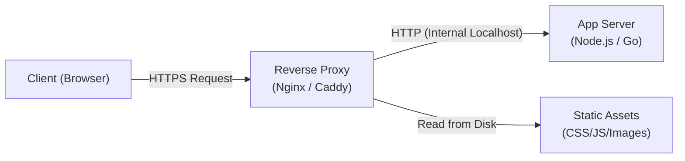

# Reverse Proxy

> A reverse proxy acts as an intermediary that accepts client requests, forwards them to one or more backend servers, and returns the server responses to the client.

Difficulty: 🟢 Beginner  
Time: 10 min  
Prerequisites:
- [HTTP](../networking/http.md)
- [HTTPS](../networking/https.md)

---

## Definition

A reverse proxy sits in front of backend web servers and acts as a gateway. When a client sends a request, the reverse proxy intercepts it, performs operations like security filtering, caching, or SSL termination, passes the request to the appropriate backend server, and passes the response back to the client. The client is never in direct contact with the backend servers.

---

## Why it Exists

Exposing application servers directly to the public internet introduces significant risks and complexity:

- **Security Exposure**: Direct exposure reveals backend server IP addresses, making them easy targets for DDoS attacks or direct intrusion.
- **CPU Overhead**: Cryptographic tasks like SSL/TLS handshakes and decryption consume valuable CPU cycles that could be used for application logic.
- **Configuration Duplication**: If you run multiple web servers or microservices, you would have to configure SSL certificates, access controls, and security headers on every single machine.
- **Inefficient Static Delivery**: Application servers (like Node.js or Python/Django) are excellent for dynamic business logic but slow and resource-heavy when serving static files like images, CSS, and JS.

A reverse proxy solves all of these problems by consolidating these tasks into a fast, dedicated entry point.

---

## Intuition

Think of a front desk receptionist or concierge in a secure office building. 

Visitors cannot walk directly into the private offices of individual employees. Instead, they must speak with the receptionist at the front desk. The receptionist verifies their identity, directs them to the correct room, or retrieves files on their behalf. 

From the visitor's perspective, the receptionist is the face of the building. The internal employees work in a protected, private environment, insulated from direct, unannounced visits.

The receptionist is the **reverse proxy**, and the office workers are the **backend servers**.

---

## Engineering Story

Suppose you run a web application. Your backend service runs on Node.js on port `3000`.

Exposing Node.js directly on the public internet means exposing its HTTP parser to potential exploits. If Node.js crashes or is flooded with requests, users get raw socket disconnects.

To solve this, the engineering team places Nginx in front of Node.js as a reverse proxy:

1. Nginx listens on port `443` (HTTPS) and handles SSL/TLS decryption.
2. If a user requests `/static/logo.png`, Nginx reads it directly from the local disk and serves it immediately. The Node.js application is never woken up.
3. If a user requests `/api/checkout`, Nginx strips the SSL layer and forwards the plain HTTP request to Node.js on `http://127.0.0.1:3000`.
4. If the Node.js process crashes, Nginx catches the connection failure and serves an elegant `502 Bad Gateway` page instead of a abrupt network timeout.

---

## How it Works

1. **Client requests a URL**: A client sends an HTTPS request to `https://example.com/api/items`.
2. **Reverse proxy intercepts**: The request hits the reverse proxy (e.g., Nginx, Envoy) listening on ports `80` or `443`.
3. **SSL/TLS Termination**: The proxy decrypts the request using the domain’s SSL certificate.
4. **Inspect and Route**: The proxy evaluates configuration rules (e.g., paths starting with `/api` go to the API server, others go to the frontend server).
5. **Forward Request**: The proxy forwards the request over the internal network to the target server.
6. **Backend Server Responds**: The backend server processes the request and sends the response back to the proxy.
7. **Proxy forwards response**: The proxy applies compression (e.g., gzip) and security headers, and sends the response to the client.

---

## Diagram



---

## Code Example

Here is a basic, functional reverse proxy written in JavaScript using the Node.js `http` module. It listens on port `8080` and proxies incoming requests to a backend server running on port `3000`.

```javascript
const http = require('http');

const BACKEND_TARGET = {
  host: '127.0.0.1',
  port: 3000
};

// Create the reverse proxy server
const proxy = http.createServer((clientReq, clientRes) => {
  // 1. Configure the request options for the backend target
  const options = {
    hostname: BACKEND_TARGET.host,
    port: BACKEND_TARGET.port,
    path: clientReq.url,
    method: clientReq.method,
    headers: {
      ...clientReq.headers,
      // Forward the original client's IP to the backend
      'x-forwarded-for': clientReq.socket.remoteAddress,
      'x-forwarded-proto': 'http'
    }
  };

  // 2. Open a connection to the backend server
  const proxyReq = http.request(options, (targetRes) => {
    // 3. Send the backend's status code and headers back to the client
    clientRes.writeHead(targetRes.statusCode, targetRes.headers);
    
    // Pipe the response body from backend to the client
    targetRes.pipe(clientRes);
  });

  // Handle errors if the backend target is down
  proxyReq.on('error', (err) => {
    console.error('Proxy Error:', err.message);
    clientRes.writeHead(502, { 'Content-Type': 'text/plain' });
    clientRes.end('502 Bad Gateway: Backend server is unreachable.');
  });

  // Pipe the client's request body (for POST/PUT requests) to the backend
  clientReq.pipe(proxyReq);
});

// Start the proxy
proxy.listen(8080, () => {
  console.log('Reverse Proxy listening on port 8080');
});
```

---

## Advantages

- **Masked Infrastructure**: Attackers only see the reverse proxy. IP addresses and operating systems of internal backend servers are hidden.
- **SSL Termination**: Decrypting HTTPS traffic at the proxy level spares backend servers from heavy CPU workloads.
- **Caching & Efficiency**: The proxy can cache frequently requested files, reducing the load on application databases and application servers.
- **Centralized Management**: Configure SSL certificates, compression, rate-limiting, and basic authentication once at the proxy rather than on multiple backends.

---

## Limitations

- **Single Point of Failure**: If the reverse proxy crashes or is misconfigured, all backend services behind it immediately become unavailable.
- **Increased Latency**: Adding a proxy introduces an extra network hop and request serialization cost.
- **Hidden Client Details**: Backend logs will show the proxy's IP address rather than the client's. Backend servers must be configured to parse forwarding headers (like `X-Forwarded-For`) to know who the real client is.

---

## Tradeoffs

### Reverse Proxy vs. Direct Access

| Metric | Reverse Proxy | Direct Access |
| :--- | :--- | :--- |
| **Security** | 🟢 High (IPs hidden, single firewall point) | 🔴 Low (All servers exposed) |
| **Performance (Static)** | 🟢 High (Optimized static serving/caching) | 🔴 Low (Dynamic apps serving file system) |
| **Latency** | 🟡 Slightly higher (+1 network hop) | 🟢 Lower (Direct connection) |
| **Complexity** | 🟡 Moderate (Extra config, routing rules) | 🟢 Low (No proxy layer setup) |

---

## Common Mistakes

- **Not Forwarding Client Headers**: Forgetting to set headers like `X-Forwarded-For` and `X-Forwarded-Proto`. Without these, backend apps cannot determine user IPs, log geolocations, or enforce IP-based rate limiting.
- **Leaking Internal Headers**: Allowing default backend server headers (like `X-Powered-By: Express` or `Server: Microsoft-IIS`) to pass through the proxy to the public. These headers give attackers information about your internal stack.
- **Unoptimized Buffer Limits**: Leaving default request/response buffer sizes. If a user uploads a large file (like a video) and the proxy buffer is too small, the proxy might fail the request with a `413 Request Entity Too Large` or run out of disk space.

---

## Real World Usage

- **Nginx & HAProxy**: The industry standards for running open-source reverse proxies in front of application instances.
- **Cloudflare**: A global cloud reverse proxy. When a user requests a site using Cloudflare, the DNS directs them to Cloudflare’s nearest edge server first, which filters attacks and serves cached pages before proxying to the actual host.
- **Envoy**: Used in modern cloud-native architectures (like Kubernetes service meshes) to manage communication and proxy traffic between microservices.

---

## Related Concepts

- **[Load Balancer](../backend/load-balancer.md)**: A load balancer is a specialized reverse proxy designed to distribute traffic across *multiple* servers. While a reverse proxy might just route traffic to one server, a load balancer balances traffic among many.
- **Forward Proxy**: A proxy that sits in front of *clients* to hide their identity or control which websites they can visit. A reverse proxy sits in front of *servers* to protect and optimize server access.
- **[API Gateway](../backend/api-gateway.md)**: A reverse proxy that also handles application-level details like authentication, API rate limiting, routing, and translating protocols (e.g., HTTP to gRPC).

---

## What to Learn Next

HTTP
↓
**Reverse Proxy**
↓
[Load Balancer](../backend/load-balancer.md)
↓
[API Gateway](../backend/api-gateway.md)

---

## Interview Questions

- **What is the difference between a Forward Proxy and a Reverse Proxy?**  
  *Answer: A forward proxy routes requests on behalf of clients (often to bypass firewalls or browse anonymously). A reverse proxy routes requests on behalf of servers (to protect them, handle SSL, and manage load).*
- **What is SSL/TLS termination, and why do we perform it at the reverse proxy level?**  
  *Answer: SSL termination is the decryption of SSL/TLS encrypted traffic. Doing this at the proxy level offloads intensive cryptographic processing from backend application servers, and centralizes certificate renewal.*
- **Why do backend application logs show the proxy's IP instead of the client's IP, and how do you fix it?**  
  *Answer: Because the TCP connection is established between the proxy and the backend. To fix it, the proxy must inject the client's IP into custom headers like `X-Forwarded-For`, and the backend must be configured to trust and parse this header.*

---

## TLDR

- A reverse proxy intercepts client requests and forwards them to internal backend servers.
- It hides backend servers' IP addresses from the public internet, dramatically improving security.
- It offloads resource-heavy cryptographic tasks through SSL/TLS termination.
- It boosts performance by caching files and serving static assets directly from disk.
- Nginx, HAProxy, and Cloudflare are standard examples of reverse proxies in production.
