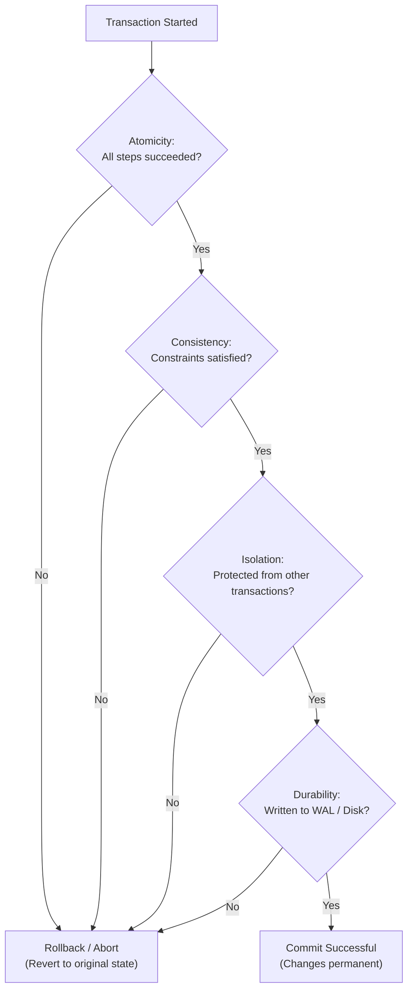

# ACID

> ACID is a set of database transaction properties (Atomicity, Consistency, Isolation, Durability) that guarantee data integrity and reliability despite system crashes, power failures, or errors.

Difficulty: 🟢 Beginner  
Time: 12 min  
Prerequisites:
- None

---

## Definition

ACID is an acronym representing the four foundational properties of a database transaction: **Atomicity**, **Consistency**, **Isolation**, and **Durability**. Together, these properties ensure that any database operation is treated as a single, secure unit of work that transitions the database from one valid state to another, even when multiple users access the system simultaneously or crashes occur mid-operation.

---

## Why it Exists

Without ACID guarantees, a database is highly vulnerable to data corruption and inconsistencies:

- **Partial Failures**: If a server crashes halfway through a multi-step operation, the database is left in a corrupted "halfway-done" state.
- **Concurrent Conflicts**: If two users modify the same record at the exactly same millisecond, they can overwrite each other's changes, leading to lost updates.
- **Temporary State Leakage**: Users could read intermediate, incorrect data from an incomplete process before it is officially finished.
- **Data Loss on Crash**: A sudden power outage could wipe out updates that were kept in volatile RAM and not yet written to physical disk.

ACID solves these issues by creating a boundary around operations, guaranteeing that data remains correct no matter what happens to the hardware or execution timing.

---

## Intuition

Think of booking a flight online. 

The booking process requires two steps:
1. Reserving your seat.
2. Charging your credit card.

If the system reserves your seat but fails to charge your card, the airline loses money. If the system charges your card but fails to reserve the seat, you get stranded. 

To avoid this, the airline wraps both steps in a single transaction. Either both steps succeed, or neither does. If anything fails in step 2, step 1 is automatically undone (rolled back).

This "all-or-nothing" execution boundary is the core of ACID.

---

## Engineering Story

A digital wallet company handles peer-to-peer money transfers. 

Alice wants to transfer \$100 to Bob. The database needs to perform two SQL queries:
1. `UPDATE accounts SET balance = balance - 100 WHERE user = 'Alice';`
2. `UPDATE accounts SET balance = balance + 100 WHERE user = 'Bob';`

If the database executes the first query and then immediately loses power, Alice loses \$100 but Bob never receives it. The \$100 vanishes into thin air.

By wrapping these queries in an ACID-compliant transaction, the database ensures safety:
- **Atomicity**: If the power cuts out during query 2, the database rolls back query 1. Alice keeps her \$100.
- **Consistency**: If Alice's account has a validation rule stating balances cannot go below \$0, and she only had \$50, the transaction aborts entirely.
- **Isolation**: If Carol tries to read Bob's balance while Alice's transfer is mid-flight, Carol will see Bob's old balance—never Bob's balance with the half-delivered \$100.
- **Durability**: Once the transaction reports "Success," the database guarantees the \$100 transfer is permanently written to disk. Even if the server is unplugged a microsecond later, Bob's new balance remains safe.

---

## How it Works

ACID is implemented through four distinct mechanisms:

### 1. Atomicity ("All or Nothing")
A transaction is treated as a single logical unit of work. If even one query fails, the entire transaction is aborted and rolled back, leaving the database unchanged.
* *How it's built*: Databases keep an **Undo Log**. As changes are made, the database logs how to reverse them. If a rollback is triggered, the database executes the undo log to restore the original state.

### 2. Consistency ("Valid Transitions Only")
A transaction can only transition the database from one valid state to another, preserving all schema rules, constraints (like `NOT NULL` or `UNIQUE`), and foreign keys.
* *How it's built*: The database engine checks constraints before committing. If a rule is violated, the transaction is rejected and rolled back.

### 3. Isolation ("No Interference")
Concurrent transactions must execute without interfering with one another. The outcome of executing multiple transactions concurrently must be the same as executing them one after another (serially).
* *How it's built*: Databases use **Locks** (preventing others from writing to or reading a row) or **Multi-Version Concurrency Control (MVCC)**, which gives each transaction a private snapshot of the data.

### 4. Durability ("Permanent Commit")
Once a transaction is committed, its changes are permanent and will survive any subsequent system crash or power outage.
* *How it's built*: Databases write transaction details to a **Write-Ahead Log (WAL)** on non-volatile disk *before* modifying the actual database files. On startup after a crash, the database reads the WAL to replay any committed transactions that didn't make it to the main database file.

---

## Diagram



---

## Code Example

Here is an example in Node.js using the `pg` library (PostgreSQL client) illustrating how a bank transfer transaction is executed, committed, or rolled back.

```javascript
const { Client } = require('pg');

async function transferFunds(fromUser, toUser, amount) {
  const client = new Client({ connectionString: 'postgresql://localhost/bank' });
  await client.connect();

  try {
    // 1. Begin the ACID transaction
    await client.query('BEGIN');

    // 2. Deduct amount from sender (ensuring they have enough funds)
    const deductResult = await client.query(
      'UPDATE accounts SET balance = balance - $1 WHERE username = $2 AND balance >= $1',
      [amount, fromUser]
    );

    // If rowCount is 0, the sender does not exist or has insufficient funds
    if (deductResult.rowCount === 0) {
      throw new Error('Insufficient funds or sender account not found');
    }

    // 3. Add amount to receiver
    const addResult = await client.query(
      'UPDATE accounts SET balance = balance + $1 WHERE username = $2',
      [amount, toUser]
    );

    if (addResult.rowCount === 0) {
      throw new Error('Receiver account not found');
    }

    // 4. Commit all queries as a single atomic unit
    await client.query('COMMIT');
    console.log(`Successfully transferred $${amount} from ${fromUser} to ${toUser}.`);

  } catch (error) {
    // 5. If any error occurred, rollback all changes
    await client.query('ROLLBACK');
    console.error('Transaction failed. Rolled back successfully. Reason:', error.message);
  } finally {
    await client.end();
  }
}
```

---

## Advantages

- **Data Integrity**: Guarantees that data is never left in a corrupt or inconsistent state.
- **Simplified Code**: Developers do not need to write complex recovery code for partial failures; the database handles the rollback automatically.
- **Safe Concurrency**: Multiple backend servers can read and write to the same database simultaneously without corrupting the state.

---

## Limitations

- **Performance Cost**: Locking and writing to the WAL disk block operations, which slows down write throughput.
- **Scaling Bottlenecks**: Strictly maintaining ACID across multiple distributed servers (horizontal scaling) requires complex protocols like Two-Phase Commit (2PC), which adds substantial latency.
- **Deadlocks**: When two transactions wait on locks held by each other, the database must detect and abort one of them.

---

## Tradeoffs

### ACID vs. BASE

To scale horizontally, databases often trade ACID guarantees for **BASE** (Basically Available, Soft state, Eventual consistency).

| Metric | ACID (Relational / SQL) | BASE (NoSQL / Distributed) |
| :--- | :--- | :--- |
| **Consistency** | 🟢 Immediate (Strong consistency) | 🟡 Eventual (Data syncs over time) |
| **Performance** | 🟡 Lower throughput (Write locks) | 🟢 Extremely high write throughput |
| **Scalability** | 🟡 Vertical scaling preferred | 🟢 Horizontal scaling natively |
| **Best For** | Banking, billing, inventory, auth | Analytics, social feeds, chat logs |

---

## Common Mistakes

- **Long-Running Transactions**: Keeping a transaction open while waiting for network requests (e.g., calling an external payment gateway API). This holds database locks open, exhausting connection pools and stalling other queries. *Keep transactions as short as possible.*
- **Assuming Auto-Commit is a Transaction**: Believing that running multiple statements sequentially without `BEGIN` and `COMMIT` block protection is safe. If the app server crashes between queries, the database leaves them partially applied.
- **Over-specifying Isolation Levels**: Setting the isolation level to `SERIALIZABLE` by default. While this is the safest level, it causes massive performance penalties. Use the default level (usually `READ COMMITTED`) unless you have specific concurrency bugs to avoid.

---

## Real World Usage

- **PostgreSQL / MySQL (InnoDB)**: Standard relational databases that provide complete, local ACID compliance out of the box.
- **CockroachDB / Google Spanner**: Modern "NewSQL" databases that provide ACID guarantees globally across multiple physical data centers using atomic clocks and consensus algorithms.
- **MongoDB**: Originally a NoSQL database with document-level ACID guarantees, it added multi-document ACID transactions in newer versions to accommodate financial applications.

---

## Related Concepts

- **BASE**: The alternative consistency model used in highly distributed NoSQL databases.
- **[Isolation Levels](../databases/isolation-levels.md)**: Settings that let developers choose the balance between query performance and protection against isolation bugs.
- **WAL (Write-Ahead Logging)**: The log mechanism used to ensure Durability.
- **MVCC**: The concurrency method that enables high-performance Isolation by keeping versioned snapshots of database rows.

---

## What to Learn Next

Databases (Basic)
↓
**ACID**
↓
[Isolation Levels](../databases/isolation-levels.md)
↓
[MVCC](../databases/mvcc.md)

---

## Interview Questions

- **What does the 'I' in ACID stand for, and why is it important?**  
  *Answer: Isolation. It ensures that concurrent transactions do not interfere with each other, preventing anomalies like dirty reads, non-repeatable reads, and phantom reads.*
- **How does a database guarantee Durability in the event of a sudden power outage?**  
  *Answer: By writing transaction records to a non-volatile Write-Ahead Log (WAL) on disk before committing. When the server boots back up, it replays the WAL to recover any committed changes not yet flushed to the main database file.*
- **Why is it a bad idea to make an external API call inside a database transaction?**  
  *Answer: Transactions hold database locks. API calls over the internet take unpredictable amounts of time. Keeping locks open for seconds instead of milliseconds blocks other operations and can freeze the database.*

---

## TLDR

- **A**tomicity: All queries in a transaction succeed, or the entire block is rolled back.
- **C**onsistency: The database state always satisfies defined rules, constraints, and schemas.
- **I**solation: Concurrent transactions operate in isolation, without dirtying each other's data.
- **D**urability: Once committed, data is permanently saved to disk and survives system crashes.
- ACID is ideal for transactional integrity (finance), while BASE is chosen for massive scale and speed.
