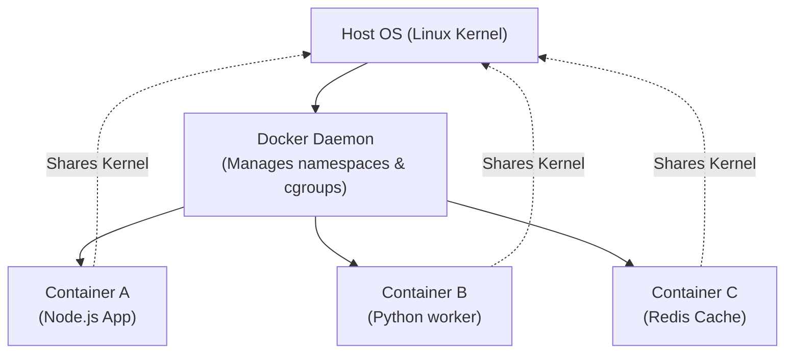

# Docker

> Docker is a containerization platform that packages an application and all its dependencies into a single, lightweight container, ensuring the application runs consistently across different computing environments.

Difficulty: 🟢 Beginner  
Time: 10 min  
Prerequisites:
- None

---

## Definition

Docker allows developers to isolate an application from its host environment by wrapping it in a container. A container includes the application code, runtime, system tools, and libraries needed to run it. Unlike Virtual Machines, which package a whole operating system, Docker containers share the host operating system's kernel, making them exceptionally fast, small, and resource-efficient.

---

## Why it Exists

Before containerization, software development suffered from two main problems:

- **Dependency Hell ("It works on my machine")**: A service might run perfectly on a developer's laptop but fail in production due to different versions of language runtimes, missing system libraries, or conflicting environment configurations.
- **Heavy Virtual Machines (VMs)**: To isolate applications on the same physical server, engineers used VMs. However, each VM requires its own guest operating system, consuming gigabytes of storage and RAM, and taking minutes to boot.

Docker solves these problems by providing lightweight, isolated environments (containers) that behave identically on a local laptop, a staging server, or a cloud production cluster.

---

## Intuition

Think of physical shipping containers. 

Before their invention in the 1950s, cargo was loaded loose: barrels of wine, crates of fruit, and sacks of grain were piled into ships. Port workers spent days manually packing and unpacking ships. The cargo was easily damaged, and different ships required different loading techniques.

The shipping container standardized everything. A container is a metal box of a fixed size. The ship, crane, and truck do not care what is inside the container (whether it is electronics, cars, or food). They only care that the box has standard dimensions and standard locking mechanisms.

Docker is the shipping container for software. The host operating system is the ship, and your application is the cargo.

---

## Engineering Story

An engineering team is building a web application with a Node.js backend and a Python background worker that generates PDFs using a specific system utility (`wkhtmltopdf`).

- **The Problem**: On macOS local machines, developers install Node.js and Python via Homebrew. On the staging server (running Ubuntu), the system administrator manually installs these tools. In production (running RedHat Enterprise Linux), the libraries are outdated, and installing the correct version of `wkhtmltopdf` breaks other applications on the server.
- **The Solution**: The team writes a Docker configuration. They package Node.js, Python, and the exact version of the PDF generator into a single Docker image. 
- **The Result**: The developers run the container locally, the CI/CD pipeline tests the exact same container, and production runs the identical container. Environment discrepancies disappear overnight.

---

## How it Works

Docker relies on three core concepts: the Dockerfile, the Image, and the Container.

```
 Dockerfile (Recipe)  ──>  Image (Blueprint)  ──>  Container (Active Instance)
```

1. **Dockerfile**: A text file containing a list of instructions detailing how to assemble the application's environment.
2. **Image**: A read-only template built from the Dockerfile. It contains the exact filesystem snapshot of your application and dependencies.
3. **Container**: A runnable instance of an image. You can start, stop, and delete containers. Each container has a tiny writeable layer on top of the read-only image layers.

### Operating System Level Virtualization

Docker doesn't package an OS kernel. Instead, it uses two Linux kernel features to isolate containers:
- **Namespaces**: Isolates what a container can *see*. It gives the container its own private view of processes (PID namespace), network interfaces (NET namespace), and mount points (MNT namespace).
- **Control Groups (cgroups)**: Isolates what a container can *use*. It limits resource usage, preventing a single container from consuming all host CPU, memory, or disk I/O.

---

## Diagram



---

## Code Example

Here is a standard `Dockerfile` used to package a Node.js web application:

```dockerfile
# 1. Start from an official, lightweight Node.js base image
FROM node:20-alpine

# 2. Set the working directory inside the container
WORKDIR /usr/src/app

# 3. Copy package files first to leverage Docker's build cache
# If package.json hasn't changed, Docker skips npm install on subsequent builds
COPY package*.json ./

# 4. Install only production dependencies
RUN npm ci --only=production

# 5. Copy the rest of the application files
COPY . .

# 6. Tell Docker that the container listens on port 3000 at runtime
EXPOSE 3000

# 7. Define the default command to run the application
CMD [ "node", "server.js" ]
```

To run this application, an engineer executes two commands in their terminal:

```bash
# Build the image and name it "my-node-app"
docker build -t my-node-app .

# Run the image in a container, mapping host port 8080 to container port 3000
docker run -d -p 8080:3000 my-node-app
```

---

## Advantages

- **Environment Consistency**: Eliminates configuration drift between development, staging, and production environments.
- **Resource Efficiency**: Since containers share the host kernel, you can run dozens of containers on the same hardware that could only support a few virtual machines.
- **Rapid Start Time**: Containers start in milliseconds because they do not have to boot a guest OS.
- **Isolation**: If an application inside a container crashes or has a security vulnerability, the host machine and other containers remain protected.

---

## Limitations

- **Kernel Dependency**: A container must share the host OS kernel. You cannot run a native Windows container directly on a native Linux host (and vice versa) without a virtualization layer.
- **Slightly Thinner Security**: VMs offer stronger security isolation than containers because they do not share the kernel. If a container exploits a kernel vulnerability, it could theoretically access the host.
- **Storage Performance**: Ephemeral containers lose their files when deleted. Saving data requires configuring Docker Volumes, which can have slower I/O performance on macOS and Windows hosts due to filesystem translation layers.

---

## Tradeoffs

### Containers vs. Virtual Machines

| Feature | Docker Containers | Virtual Machines (VMs) |
| :--- | :--- | :--- |
| **Isolation** | 🟡 Process-level (Shares host OS kernel) | 🟢 OS-level (Separate guest OS kernel) |
| **Size** | 🟢 Small (Megabytes) | 🔴 Large (Gigabytes) |
| **Startup** | 🟢 Immediate (Milliseconds) | 🔴 Slow (Minutes) |
| **Resource Usage**| 🟢 Minimal | 🔴 High (CPU & RAM reserved for OS) |

---

## Common Mistakes

- **Storing State Inside a Container**: Containers are designed to be temporary (ephemeral). If a container is restarted or recreated, any files written inside it are lost forever. *Always write persistent data to external volumes or database services.*
- **Large Image Sizes**: Copying unnecessary files (like `node_modules`, log files, or raw media assets) into the image. *Always use a `.dockerignore` file to exclude files, and choose minimal base images (like Alpine Linux).*
- **Running as Root**: By default, Docker runs container processes as the root user. If an attacker compromises your application, they gain root access inside the container. *Always use the `USER` instruction in your Dockerfile to run processes as a non-privileged user.*

---

## Real World Usage

- **Microservices**: A single system architecture might run a React frontend, Python API, Go worker, and Postgres database, each in its own container, communicating over a local network bridge.
- **CI/CD Pipelines**: Automated test suites build a Docker image of the branch code and run tests inside it, ensuring that tests execute in an environment identical to production.
- **Kubernetes**: Orchestration platforms like Kubernetes manage thousands of Docker containers across clusters of servers, automating scaling, rolling deployments, and self-healing.

---

## Related Concepts

- **Kubernetes**: A container orchestrator that manages, scales, and networks groups of containers across physical servers.
- **Virtual Machine**: A software-based emulation of a physical computer, running a complete guest operating system.
- **Docker Compose**: A tool for defining and running multi-container Docker applications using a single YAML configuration file.

---

## What to Learn Next

**Docker**
↓
Kubernetes
↓
Helm

---

## Interview Questions

- **What is the difference between a Docker Image and a Docker Container?**  
  *Answer: An image is a read-only template containing the application code, libraries, and settings (the blueprint). A container is a running, stateful instance of that image.*
- **How does Docker differ from a Virtual Machine?**  
  *Answer: Virtual Machines virtualize hardware and run a complete guest OS on top of a hypervisor. Docker containers virtualize the operating system, sharing the host OS kernel and running as isolated user-space processes.*
- **What is the purpose of a `.dockerignore` file?**  
  *Answer: It tells Docker which files and directories (such as `node_modules`, local `.env` configuration files, or temporary logs) to ignore when copying files into the image. This speeds up build times and keeps image sizes small.*

---

## TLDR

- Docker packages applications and dependencies into standard, isolated containers.
- It solves the "works on my machine" problem by ensuring dev and prod environments match exactly.
- Containers share the host kernel, making them much faster and smaller than Virtual Machines.
- A **Dockerfile** compiles into an **Image** (blueprint) which runs as a **Container** (instance).
- Databases and stateful apps should use **Docker Volumes** to prevent data loss when containers exit.
