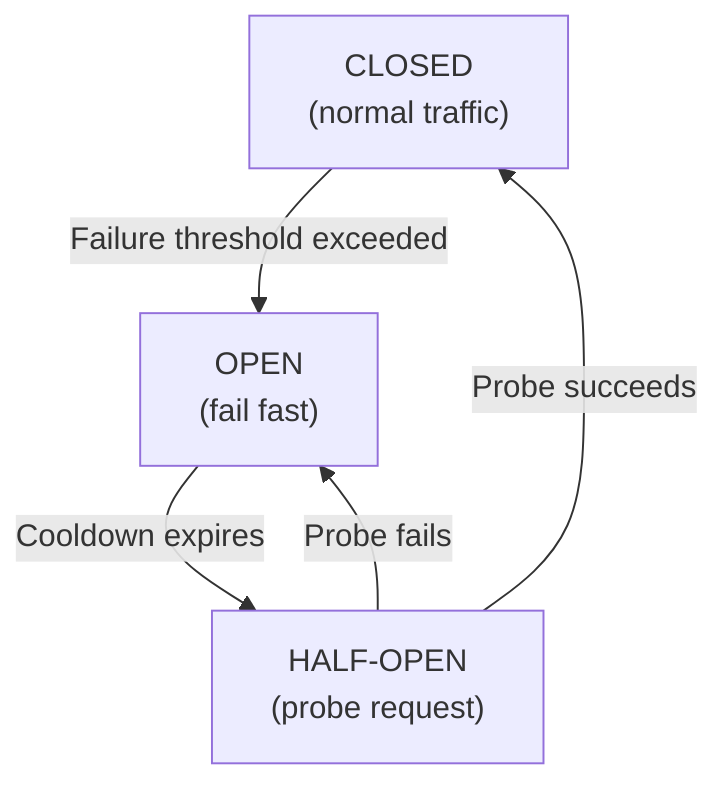

# Circuit Breaker

> A circuit breaker is a resilience pattern that stops sending requests to a failing dependency until it shows signs of recovery.

Difficulty: 🟡 Intermediate
Time: 12 min
Prerequisites:
- [Retry](../distributed-systems/retry.md)
- [HTTP](../networking/http.md)

---

## Definition

A circuit breaker sits between a service and its dependency, tracking failure rates and temporarily cutting off traffic when failures spike beyond a threshold. It allows the dependency time to recover instead of being crushed by a flood of doomed requests.

---

## Why it Exists

[Retries](../distributed-systems/retry.md) handle transient failures — a server blip, a dropped packet, a momentary overload. They work by giving the system a second (or third) chance to succeed.

But what happens when a dependency isn't briefly struggling — it's actually down? Hard down. For 30 seconds. For 2 minutes. A retry policy alone becomes a liability:

- Every failing request retries 3 times → 3× the traffic hitting a dying service
- Threads pile up waiting for timeouts that never come
- Latency cascades through the entire system
- A slow payment service takes down the checkout page

This is **cascading failure**: one sick dependency infects the services that call it, which infect the services that call them.

The circuit breaker solves this by detecting prolonged failure and stopping the bleeding early. Instead of hammering a dependency that can't respond, it fails fast — returning an error immediately, freeing resources, and giving the downstream service room to breathe.

---

## Intuition

Your home's electrical circuit breaker does exactly this. When too much current flows — a short circuit, an overloaded outlet — the breaker trips. Power stops. The wiring doesn't melt.

When you reset the breaker, it lets current flow again. If the problem is still there, it trips again. If the problem is fixed, everything works normally.

A software circuit breaker works the same way: when failure crosses a threshold, it "trips" and stops requests from flowing. After a cooldown, it lets a test request through. If it succeeds, the breaker resets. If it fails, the breaker stays tripped.

---

## Engineering Story

A food delivery app has a `recommendations` service that calls a third-party `restaurant-data` API to fetch nearby restaurants. On a Saturday evening — peak traffic — the `restaurant-data` API starts returning `503` errors due to overload.

Without a circuit breaker:
- Every user loading the home screen fires a request to `recommendations`
- `recommendations` retries 3 times per user
- After 30 seconds of retries, each request times out
- Thread pools fill up waiting for responses
- The home screen starts timing out entirely — the problem has spread

With a circuit breaker:
- After the first 10 failures in 30 seconds, the breaker trips
- Subsequent requests to `restaurant-data` fail immediately with a cached or empty response
- The home screen loads instantly (showing fewer recommendations, but loading)
- After 60 seconds, the breaker sends one probe request — the API has recovered
- The breaker resets, and recommendations flow normally

The outage was isolated. The home screen stayed functional.

---

## How it Works

A circuit breaker has three states:

### Closed (normal operation)

Requests flow through normally. The breaker counts failures in a sliding window (e.g., the last 60 seconds or last 100 requests).

When failures exceed the threshold (e.g., 50% failure rate or 10 consecutive failures), the breaker **trips** to the Open state.

### Open (failing fast)

All requests are rejected immediately — without even attempting to contact the dependency. The breaker returns a cached value, a fallback, or an error response.

The breaker stays Open for a configured cooldown period (e.g., 30 seconds).

### Half-Open (testing recovery)

After the cooldown, the breaker lets a single probe request through to the dependency.

- If it succeeds → the breaker resets to **Closed**. Normal traffic resumes.
- If it fails → the breaker returns to **Open** and starts the cooldown again.

---

## Diagram



---

## Code Example

A minimal circuit breaker implementation:

```javascript
class CircuitBreaker {
  constructor(request, options = {}) {
    this.request = request;
    this.state = 'CLOSED';
    this.failureCount = 0;
    this.lastFailureTime = null;

    this.failureThreshold = options.failureThreshold ?? 5;
    this.cooldownMs = options.cooldownMs ?? 30_000;
  }

  async call(...args) {
    if (this.state === 'OPEN') {
      const elapsed = Date.now() - this.lastFailureTime;

      if (elapsed < this.cooldownMs) {
        throw new Error('Circuit breaker is OPEN — request blocked');
      }

      // Cooldown expired — move to HALF-OPEN and probe
      this.state = 'HALF-OPEN';
    }

    try {
      const result = await this.request(...args);
      this.onSuccess();
      return result;
    } catch (err) {
      this.onFailure();
      throw err;
    }
  }

  onSuccess() {
    this.failureCount = 0;
    this.state = 'CLOSED';
  }

  onFailure() {
    this.failureCount++;
    this.lastFailureTime = Date.now();

    if (this.failureCount >= this.failureThreshold) {
      this.state = 'OPEN';
    }
  }
}

// Usage
const breaker = new CircuitBreaker(fetchRestaurantData, {
  failureThreshold: 5,
  cooldownMs: 30_000,
});

try {
  const data = await breaker.call(restaurantId);
} catch (err) {
  // Either the dependency failed or the breaker is OPEN
  return getCachedRestaurants(); // fallback
}
```

The key insight: when the breaker is `OPEN`, it doesn't wait for a timeout — it fails *immediately*. That's what frees up threads and keeps response times fast.

---

## Advantages

- **Prevents cascading failure.** Isolates a broken dependency before it takes down callers.
- **Fails fast.** Blocked requests return immediately instead of waiting for a timeout, keeping latency predictable.
- **Gives dependencies time to recover.** Rather than hammering a struggling service, the breaker steps back and waits.
- **Self-healing.** The Half-Open state means recovery is automatic — no manual intervention needed.

---

## Limitations

- **False trips.** A brief spike in errors (a momentary network issue, a rolling restart) can trip the breaker unnecessarily, degrading the service even after the dependency recovers.
- **Requires fallback logic.** A tripped breaker needs somewhere to go — a cache, a default response, a degraded mode. If there's no fallback, the breaker just converts one error into a different error.
- **Threshold tuning is hard.** Too low a threshold trips on normal variance. Too high, and the breaker doesn't protect you when you need it. Getting these numbers right requires production data.
- **Shared state in distributed deployments.** If you have 50 instances of a service, each has its own breaker tracking its own failure count. One instance might trip while others are fine. Centralizing breaker state (e.g., in Redis) adds complexity.

---

## Common Mistakes

- **Using a circuit breaker without a fallback.** A tripped breaker that just throws an error is only marginally better than no breaker at all. The value comes from the fallback — cached data, an empty state, a graceful degraded response.
- **Setting the threshold too low.** A threshold of 1 failure trips on any error, including expected ones. Tune thresholds against real traffic data, not guesses.
- **Not monitoring breaker state.** A breaker that trips silently is invisible. Track state transitions as metrics and alert on breakers that stay Open — that's a dependency that may need manual intervention.
- **Applying it everywhere indiscriminately.** Circuit breakers add overhead and complexity. They make most sense for calls to external services, third-party APIs, and non-critical internal dependencies. Don't wrap your primary database in a circuit breaker without a clear fallback strategy.
- **Confusing circuit breakers with retries.** Retries handle transient failures (short blips). Circuit breakers handle prolonged failures (extended outages). They complement each other — a circuit breaker should wrap a retry policy, not replace it.

---

## Related Concepts

- **[Retry](../distributed-systems/retry.md)** — Handles transient failures. A circuit breaker should sit above a retry policy — it stops retrying entirely when the failure is clearly sustained.
- **Bulkhead** — Limits the blast radius of a failure by isolating thread pools or connection pools per dependency. Pairs well with circuit breakers.
- **Fallback** — The response the system returns when the circuit breaker trips. Without a fallback strategy, a circuit breaker just changes the shape of the failure.
- **Timeout** — The first line of defense against slow dependencies. Circuit breakers typically count timeouts as failures, so timeouts and breakers work together.

---

## Interview Questions

- **What's the difference between a circuit breaker and a retry?** (Tests conceptual clarity — retries handle transient blips; circuit breakers handle prolonged outages. They complement each other.)
- **What are the three states of a circuit breaker?** (Tests knowledge of Closed, Open, and Half-Open, and the transitions between them.)
- **Why does a circuit breaker fail fast instead of waiting?** (Tests understanding of the core value — fast failure frees threads and keeps response times predictable instead of letting timeouts cascade.)
- **What happens when a circuit breaker trips but there's no fallback?** (Tests practical thinking — without a fallback, the breaker just converts one kind of error into another, providing little real benefit.)

---

## TLDR

- A circuit breaker stops requests to a failing dependency, giving it time to recover.
- Three states: **Closed** (normal), **Open** (fail fast), **Half-Open** (probe for recovery).
- It fails fast — blocking requests immediately instead of waiting for timeouts.
- Always pair it with a fallback: cached data, a degraded response, or a default value.
- Complements retries — use both, not one or the other.
