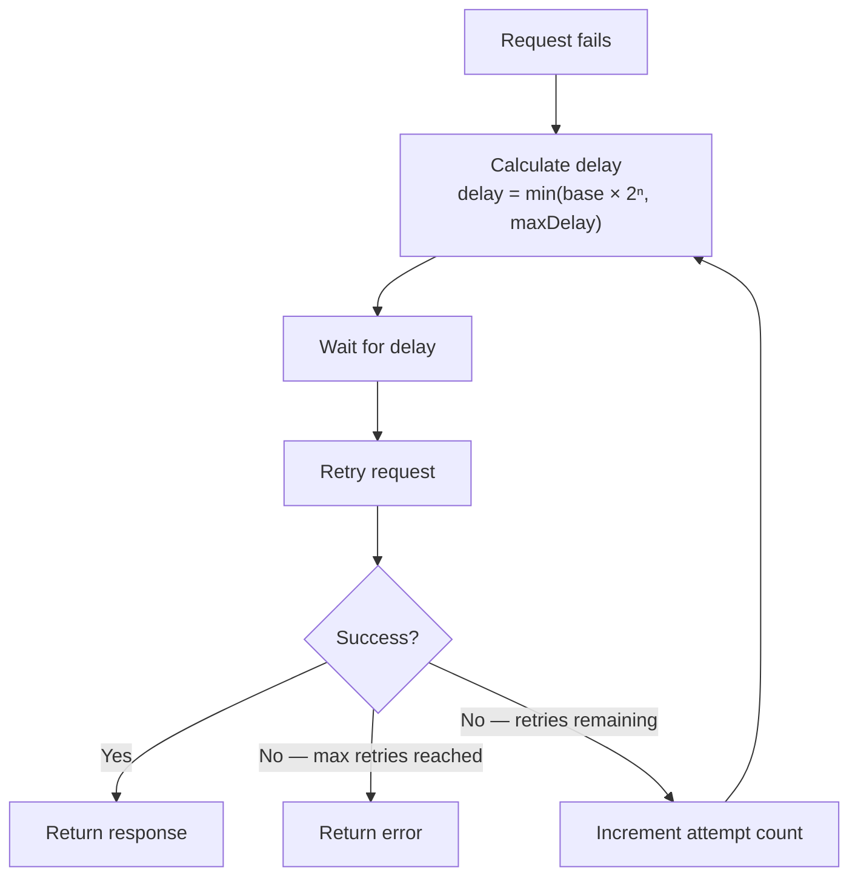

# Exponential Backoff

> Exponential backoff is a retry delay strategy that doubles the wait time after each failed attempt, giving an overloaded or recovering system progressively more time to recover before the next request arrives.

Difficulty: 🟡 Intermediate
Time: 10 min
Prerequisites:
- [Retry](../distributed-systems/retry.md)

---

## Definition

Exponential backoff is a timing algorithm for spacing out retry attempts. Instead of waiting a fixed interval between retries, the delay grows exponentially — doubling after each failure. A retry that waits 1 second on the first attempt will wait 2 seconds on the second, 4 on the third, and so on.

---

## Why it Exists

When a server fails, it's usually under stress — overloaded, restarting, or temporarily degraded. Retrying immediately after a failure doesn't help; the same overloaded server receives the same request a fraction of a second later.

Fixed delays are better, but they have a flaw: if 1,000 clients all fail at the same moment and all retry after the same 1-second fixed delay, they arrive in a synchronized wave that hits the server again at the same instant. The server, still recovering, gets slammed again.

Exponential backoff solves this by giving the server increasingly more breathing room after each failure. The longer the outage, the more space there is between retries — and the smaller each retry wave becomes.

---

## Intuition

Imagine you try to call a friend. The line is busy. You wait 30 seconds and try again — still busy. You wait a minute. Then two minutes. Then four.

You're not hammering the line every 30 seconds forever. You're giving the situation room to resolve. If it's a brief blip, your first retry catches it. If it's something serious, you back off and stop making things worse.

That's exponential backoff: the delay adapts to the severity of the problem.

---

## Engineering Story

It's Black Friday. Stripe's payment processing API is handling 10x its normal traffic. One of their database read replicas falls behind and starts returning `503` errors for 8 seconds while it catches up.

Every mobile app checkout flow in the country that fails at this moment is configured with retries. With fixed 1-second retries, all 50,000 clients retry at t=1s, then again at t=2s, then t=3s — sending synchronized request spikes to an already-struggling system. The replica never gets a chance to recover.

With exponential backoff, clients spread out: some retry at 1s, some at 2s, some at 4s. By t=4s the replica has caught up. Traffic normalizes. Most users experience a 3–4 second delay and never see an error.

---

## How it Works

The core formula is:

```
delay = base * (multiplier ^ attempt)
```

Where:
- `base` — the initial delay (commonly 1 second)
- `multiplier` — the growth factor (commonly 2, which gives *exponential* growth)
- `attempt` — the zero-indexed retry count (0 for first retry, 1 for second, etc.)

**Example with base = 1s, multiplier = 2:**

| Attempt | Formula | Delay |
|---------|---------|-------|
| 1st retry | 1 × 2⁰ | 1s |
| 2nd retry | 1 × 2¹ | 2s |
| 3rd retry | 1 × 2² | 4s |
| 4th retry | 1 × 2³ | 8s |
| 5th retry | 1 × 2⁴ | 16s |

To prevent delays from growing indefinitely (e.g., waiting 4096 seconds after 12 failures), a **cap** is applied:

```
delay = min(base * (multiplier ^ attempt), maxDelay)
```

A cap of 30–60 seconds is common for APIs. Beyond that, users expect an error rather than silent waiting.

---

## Diagram



---

## Code Example

```javascript
async function fetchWithExponentialBackoff(url, options = {}) {
  const MAX_RETRIES = 5;
  const BASE_DELAY_MS = 1000;   // 1 second
  const MAX_DELAY_MS = 30000;   // 30 seconds cap
  const RETRYABLE_CODES = new Set([429, 500, 502, 503, 504]);

  for (let attempt = 0; attempt < MAX_RETRIES; attempt++) {
    try {
      const response = await fetch(url, options);

      if (!RETRYABLE_CODES.has(response.status)) {
        return response; // Success, or non-retryable error (4xx)
      }

      if (attempt === MAX_RETRIES - 1) {
        throw new Error(`Failed after ${MAX_RETRIES} attempts: ${response.status}`);
      }
    } catch (err) {
      if (attempt === MAX_RETRIES - 1) throw err;
    }

    // Exponential backoff: 1s, 2s, 4s, 8s, 16s — capped at 30s
    const delay = Math.min(BASE_DELAY_MS * Math.pow(2, attempt), MAX_DELAY_MS);
    await sleep(delay);
  }
}

const sleep = (ms) => new Promise((resolve) => setTimeout(resolve, ms));
```

The key decisions in this code:
- **`Math.pow(2, attempt)`** — produces the exponential growth sequence (1, 2, 4, 8...).
- **`Math.min(..., MAX_DELAY_MS)`** — caps the delay so retries don't become absurdly long.
- **`RETRYABLE_CODES`** — only server-side errors get retried. `4xx` client errors are returned immediately — retrying them wastes time and won't change the outcome.

---

## Advantages & Limitations

### Advantages

- **Reduces load on a recovering server.** Each retry wave is smaller and more spaced out than the last, giving the system room to recover.
- **Self-tuning to outage length.** A brief blip is caught by the first or second retry. A longer outage naturally extends the retry window without any configuration.
- **Simple to implement correctly.** One formula, one cap, reusable across any HTTP client.

### Limitations

- **Increases tail latency.** The worst-case latency for a successful retry is the sum of all delays. With base=1s and 4 retries, the maximum wait before success is 1+2+4+8 = 15 seconds — which may be too long for a user-facing operation.
- **Doesn't solve thundering herd on its own.** If all clients fail and retry at exactly the same times, exponential backoff still creates synchronized waves — just spaced further apart. The fix is to add **jitter**.
- **Not a substitute for a circuit breaker.** Exponential backoff keeps retrying until `maxRetries` is hit, even if the server is completely down for hours. A circuit breaker stops retrying when failure rate is too high.

---

## Tradeoffs

| Strategy | When to use | Cost |
|---|---|---|
| **Fixed delay** | Simple systems, low concurrency | Synchronized retry waves under load |
| **Exponential backoff** | APIs with transient failures | Higher tail latency; still synchronizes without jitter |
| **Exponential backoff + jitter** | High-concurrency systems | Slightly more complex; best overall choice for most APIs |
| **Backoff with cap** | Any production system | Required — uncapped backoff leads to multi-hour waits |

---

## Common Mistakes

- **No cap on delay.** Without `Math.min(delay, maxDelay)`, delays grow to minutes or hours after a dozen failures. Always cap at a sane maximum (30–60 seconds is typical).
- **Using exponential backoff without jitter in high-concurrency systems.** Exponential backoff spaces out *waves*, but if every client doubles their delay by the same factor, they still arrive in synchronized bursts. Add jitter.
- **Treating the delay as the total wait budget.** Engineers sometimes cap the delay at their "acceptable wait time" (e.g., 5 seconds) and forget that the *total* time is the *sum* of all delays. Budget accordingly.
- **Applying backoff to non-retryable errors.** Backing off before returning a `404 Not Found` wastes time — the resource doesn't exist; waiting won't change that.

---

## Related Concepts

- **[Retry](../distributed-systems/retry.md)** — Exponential backoff is the delay strategy *within* a retry loop. Retry defines when to re-attempt; backoff defines how long to wait.
- **Jitter** — A random offset added to the exponential delay to desynchronize retries across many clients. The standard companion to exponential backoff.
- **[Circuit Breaker](../distributed-systems/circuit-breaker.md)** — Where exponential backoff handles a *few* failures gracefully, a circuit breaker handles *sustained* failures by stopping retries entirely until the system recovers.
- **Rate Limiting / 429 Too Many Requests** — Servers signal overload with `429`. Exponential backoff is the correct client-side response to this status code.

---

## Interview Questions

- **Why is exponential backoff better than a fixed delay in a distributed system?** *(Tests systems thinking — fixed delays create synchronized retry waves; exponential backoff spreads them out and gives the server progressively more recovery time.)*
- **What happens if you don't cap the maximum delay in exponential backoff?** *(Tests edge-case awareness — delays grow unboundedly, eventually waiting hours or days between retries on a long outage.)*
- **What is the difference between exponential backoff and exponential backoff with jitter?** *(Tests depth — backoff reduces load but still synchronizes clients; jitter desynchronizes them, preventing thundering herd.)*
- **When should you NOT use exponential backoff?** *(Tests precision — non-retryable errors like 400/401/404, or operations where the user is waiting and a 15-second retry window is worse than an immediate error.)*

---

## TLDR

- Exponential backoff doubles the wait time after each failed retry: 1s → 2s → 4s → 8s.
- This gives a recovering server progressively more breathing room between retry waves.
- Always cap the maximum delay (30–60s is typical) — uncapped backoff leads to absurd wait times.
- Exponential backoff alone doesn't prevent thundering herd — add **jitter** in high-concurrency systems.
- It handles transient failures; pair it with a **circuit breaker** for sustained outages.
