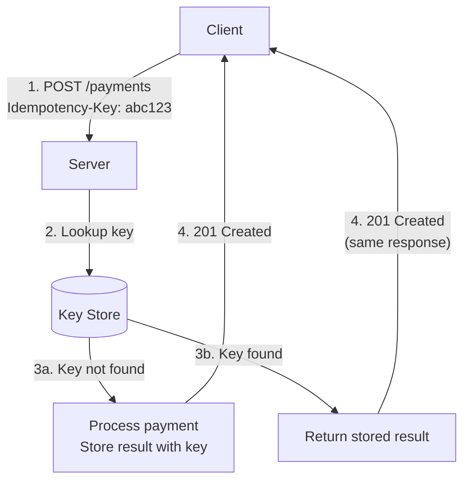

# Idempotency

> An operation is idempotent when performing it multiple times produces the same result as performing it once.

Difficulty: 🟢 Beginner
Time: 10 min
Prerequisites:
- [HTTP](../networking/http.md)

---

## Definition

Idempotency means that repeating an operation has no additional effect beyond the first execution. It's a safety guarantee — it lets systems retry operations without worrying about unintended side effects like duplicate charges, duplicate messages, or corrupted data.

---

## Why it Exists

Networks are unreliable. Requests time out, connections drop, and responses get lost. When a client doesn't receive a response, it can't tell whether the server processed the request or not. The only safe option is to retry.

Without idempotency, retrying a "Place Order" request might create two orders. Retrying a "Send Payment" request might charge the customer twice. Idempotency was designed to make retries safe — so you can send the same request again and know the system won't do the wrong thing twice.

---

## Intuition

Think of an elevator button. You press "Floor 5" once, and the elevator registers the request. You press it three more times because you're impatient — nothing changes. The elevator is still going to floor 5. It doesn't go to floor 5 four times.

That button is idempotent. No matter how many times you press it, the outcome is the same.

Now think of a vending machine. Every time you insert a coin, it adds to your balance. Insert three coins, you get three credits. That's **not** idempotent — each repetition changes the result.

---

## Engineering Story

A user taps "Pay" in a ride-sharing app. The app sends a `POST /api/payments` request to the server with the ride fare. The network is slow, and the request times out before the app gets a response.

Did the payment go through? The app doesn't know. It has two choices:

1. **Don't retry.** The user might not be charged, the driver doesn't get paid, and support has to sort it out manually.
2. **Retry.** If the server isn't idempotent, the user might get charged twice.

The engineering team solves this by making the payment endpoint idempotent. The app generates a unique `idempotency-key` (like `pay_abc123`) and includes it in every request. The server checks: "Have I already processed `pay_abc123`?" If yes, it returns the original response without charging again. If no, it processes the payment and stores the key.

Now the app can safely retry — the user is charged exactly once regardless of how many times the request is sent.

---

## How it Works

1. **Client generates a unique key.** Before sending a request, the client creates an idempotency key — usually a UUID or a deterministic hash of the operation (e.g., `user_id + order_id + amount`).

2. **Client sends the request with the key.** The key is typically passed as a header: `Idempotency-Key: pay_abc123`.

3. **Server checks for the key.** Before processing, the server looks up the key in a store (database, Redis, etc.).

4. **If the key exists — return the stored response.** The server already processed this request. It returns the saved result without executing any business logic again.

5. **If the key doesn't exist — process normally.** The server executes the operation, stores the result alongside the key, and returns the response to the client.

6. **Client retries if needed.** If the client doesn't get a response, it resends the same request with the same key. The server recognizes it and returns the stored result.

---

## Diagram



---

## Implementation

There are several common approaches engineers use to implement idempotency:

### Idempotency Keys
The most common pattern for APIs. The client sends a unique key with each request. The server stores the key and its result. Stripe, PayPal, and most payment APIs use this approach. Keys are usually expired after 24–48 hours.

### Database Unique Constraints
Use a unique constraint on a column (like `order_id` or `transaction_ref`) so that inserting a duplicate row fails gracefully instead of creating a second record. Simple and effective when the operation maps directly to a database insert.

### Conditional Writes
Use `IF NOT EXISTS` (in Cassandra) or `ON CONFLICT DO NOTHING` (in PostgreSQL) to make write operations naturally idempotent at the database level.

### Natural Idempotency
Some operations are inherently idempotent. `PUT /users/42 {"name": "Jane"}` sets the name to "Jane" regardless of how many times you call it. `DELETE /users/42` deletes the user — calling it again has no additional effect (the user is still gone).

---

## Code Example

A simplified idempotent payment endpoint:

```javascript
// server.js
const express = require("express");
const crypto = require("crypto");

const app = express();
app.use(express.json());

// In production, use Redis or a database — not an in-memory Map
const processedKeys = new Map(); // idempotencyKey -> { body, status }

app.post("/api/payments", (req, res) => {
  const key = req.headers["idempotency-key"];
  if (!key) {
    return res.status(400).json({ error: "Idempotency-Key header required" });
  }

  // Already processed? Return the stored response.
  if (processedKeys.has(key)) {
    const stored = processedKeys.get(key);
    return res.status(stored.status).json(stored.body);
  }

  // Process the payment
  const paymentId = crypto.randomUUID();
  const { amount } = req.body;

  // ... charge the customer, update database, etc.

  const responseBody = {
    payment_id: paymentId,
    amount,
    status: "completed",
  };

  // Store the result so retries return the same response
  processedKeys.set(key, { body: responseBody, status: 201 });

  return res.status(201).json(responseBody);
});

app.listen(3000);
```

```bash
# First request — payment is processed
curl -X POST http://localhost:3000/api/payments \
  -H "Content-Type: application/json" \
  -H "Idempotency-Key: pay_abc123" \
  -d '{"amount": 25.00}'

# Response: 201 Created
# {"payment_id": "...", "amount": 25, "status": "completed"}

# Retry with same key — same response, no double charge
curl -X POST http://localhost:3000/api/payments \
  -H "Content-Type: application/json" \
  -H "Idempotency-Key: pay_abc123" \
  -d '{"amount": 25.00}'

# Response: 201 Created (same payment_id, no new charge)
```

The code illustrates the core pattern: check the key before processing, store the result after processing, and return the stored result on retries.

---

## Advantages

- **Safe retries.** Clients can retry failed requests without causing duplicate side effects. This is critical for payment processing, order placement, and any operation where "doing it twice" causes real harm.
- **Simpler error handling.** Instead of building complex logic to detect whether a previous attempt succeeded, the client just retries with the same key.
- **Better user experience.** Users who double-tap a button or refresh a page don't end up with duplicate actions.
- **Resilience.** Systems that embrace idempotency handle network failures, timeouts, and load balancer retries gracefully.

---

## Limitations

- **Storage overhead.** You need to store idempotency keys and their results somewhere. For high-traffic APIs, this store can grow quickly. You'll need a TTL (time-to-live) to expire old keys.
- **Not free to implement.** Making an operation truly idempotent requires careful design. You need to handle race conditions (two identical requests arriving at the same time), decide what to store, and choose a storage backend.
- **Doesn't fix all duplication problems.** Idempotency protects against duplicate *requests*, but it doesn't prevent duplicate *intent*. If a user genuinely places two separate orders, the system should process both — the idempotency key would be different for each.
- **Key management falls on the client.** The client is responsible for generating and reusing the correct key. If the client generates a new key for each retry, idempotency doesn't work.

---

## Common Mistakes

- **Generating a new idempotency key on every retry.** The whole point is to reuse the same key. If the client creates a fresh UUID for each attempt, the server treats every request as new.
- **Using an in-memory store for keys in production.** If the server restarts, all stored keys are lost, and retries will be processed as new requests. Use a persistent store like Redis or your database.
- **Ignoring race conditions.** If two identical requests arrive at the same instant, both might pass the "key not found" check before either stores the key. Use database locks, `SETNX` in Redis, or unique constraints to prevent this.
- **Assuming all HTTP methods need idempotency keys.** GET, PUT, and DELETE are already idempotent by definition. Idempotency keys are primarily needed for POST and non-idempotent operations.
- **Never expiring stored keys.** Keys should have a TTL (typically 24–48 hours). Without expiration, the key store grows indefinitely.

---

## Related Concepts

- **[Retry](../distributed-systems/retry.md)** — Retries and idempotency go hand-in-hand. Retries are safe only when the operation is idempotent.
- **Exactly-once delivery** — The holy grail of distributed messaging. Idempotency is how most systems approximate it — they deliver at-least-once and deduplicate on the receiving end.
- **[HTTP Methods](../networking/http.md)** — GET, PUT, and DELETE are idempotent by specification. POST is not, which is why it usually needs an idempotency key.
- **Optimistic concurrency** — Uses version numbers to prevent conflicting writes, which is a related but distinct problem from idempotency.

---

## Interview Questions

- **What does idempotent mean, and which HTTP methods are idempotent?** (Tests basic understanding. GET, PUT, DELETE are idempotent; POST and PATCH are not.)
- **A user taps "Pay" and the request times out. How do you ensure they aren't charged twice?** (Tests practical application — idempotency keys, stored results, safe retries.)
- **How would you implement idempotency for a payment API?** (Tests implementation knowledge — key generation, server-side lookup, storage, race condition handling.)
- **What's the difference between idempotency and exactly-once delivery?** (Tests deeper understanding — idempotency is a property of an operation; exactly-once is a delivery guarantee that typically relies on idempotent consumers.)

---

## TLDR

- An idempotent operation produces the same result no matter how many times you execute it.
- Networks are unreliable — idempotency makes retries safe.
- The most common pattern is sending an `Idempotency-Key` header; the server deduplicates using that key.
- GET, PUT, and DELETE are naturally idempotent; POST usually needs explicit idempotency handling.
- Always store keys persistently, handle race conditions, and expire old keys.
