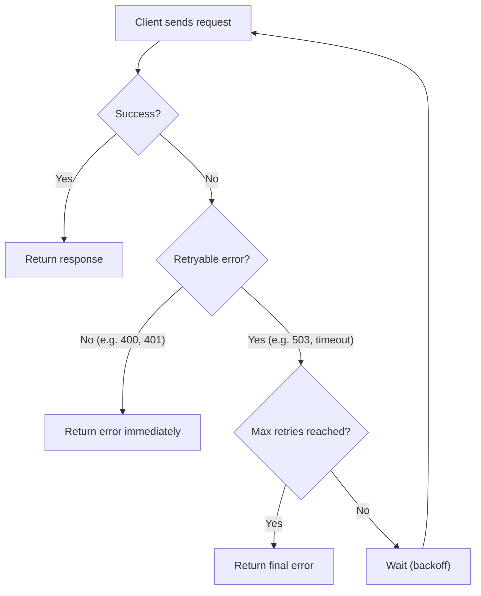

# Retry

> A retry is the automatic re-execution of a failed operation with the expectation that it may succeed on a subsequent attempt.

Difficulty: 🟢 Beginner
Time: 10 min
Prerequisites:
- [HTTP](../networking/http.md)
- [Idempotency](../distributed-systems/idempotency.md)

---

## Definition

A retry is the act of re-sending a request or re-executing an operation after a failure. It's a foundational resilience pattern that makes distributed systems tolerant of the transient failures that occur on any real network.

---

## Why it Exists

In a distributed system, things fail all the time — and most failures are temporary. A server is restarting. A database is briefly overloaded. A network packet is dropped. These are called **transient failures**, and they typically resolve on their own within milliseconds to seconds.

Without retries, every transient failure becomes a visible error to the user. With retries, the system gives itself another chance to succeed, and the user never sees the problem.

---

## Intuition

Think about sending a text message when you have poor signal. The first attempt might fail. So your phone quietly tries again. And again. When the signal recovers — even a second later — the message goes through and you never knew it failed the first time.

That's a retry: try, fail, wait a moment, try again.

---

## Engineering Story

A mobile app shows the user their order history. The app sends a `GET /orders` request to the backend. The backend is in the middle of a rolling restart — one of three server instances just went down for 3 seconds to deploy a new version.

The request hits the restarting instance and gets a `503 Service Unavailable`. Without retries, the user sees an error screen. With retries, the app waits 1 second and tries again. This time the request hits a healthy instance. The user sees their orders and never noticed anything happened.

---

## How it Works

1. **Client sends a request.** A `GET /orders` request goes out to the server.

2. **Request fails.** The server returns a `503`, or the connection times out, or a network error occurs.

3. **Client checks: is this error retryable?** Not all errors should be retried. `503 Service Unavailable` is a good candidate. `400 Bad Request` is not — if the request is malformed, retrying it won't help.

4. **Client waits.** Before retrying, the client waits for a short interval. Retrying immediately often hits the same overloaded server.

5. **Client retries.** The request is sent again, ideally identical to the first attempt.

6. **Client stops after a limit.** After a maximum number of attempts (e.g., 3 retries), the client gives up and returns an error.

---

## Diagram



---

## Retry Strategies

Not all retries are equal. The delay between attempts matters as much as the retry itself.

### Fixed Delay
Wait the same amount of time between every retry.

```
Attempt 1 → fail → wait 1s
Attempt 2 → fail → wait 1s
Attempt 3 → fail → wait 1s
Attempt 4 → fail → give up
```

Simple, but can make overload worse if many clients retry at the same moment.

### Exponential Backoff
Double the wait time after each failure.

```
Attempt 1 → fail → wait 1s
Attempt 2 → fail → wait 2s
Attempt 3 → fail → wait 4s
Attempt 4 → fail → give up
```

Gives the server increasing time to recover. The standard approach for most APIs.

### Exponential Backoff with Jitter
Add a small random delay on top of the exponential wait.

```
Attempt 1 → fail → wait 1s + random(0–500ms)
Attempt 2 → fail → wait 2s + random(0–500ms)
```

When thousands of clients retry at the same time, exponential backoff alone still creates synchronized bursts. Jitter spreads those retries out — preventing a **retry storm** where all clients retry at exactly the same moment and overwhelm the server all over again.

---

## Code Example

A simple retry helper with exponential backoff and jitter:

```javascript
async function fetchWithRetry(url, options = {}, maxRetries = 3) {
  const RETRYABLE_STATUS_CODES = new Set([429, 500, 502, 503, 504]);

  for (let attempt = 1; attempt <= maxRetries; attempt++) {
    try {
      const response = await fetch(url, options);

      // Don't retry client errors like 400 or 401
      if (!RETRYABLE_STATUS_CODES.has(response.status)) {
        return response;
      }

      if (attempt === maxRetries) {
        throw new Error(`Request failed after ${maxRetries} attempts: ${response.status}`);
      }

      // Exponential backoff with jitter
      const baseDelay = Math.pow(2, attempt) * 1000; // 2s, 4s, 8s...
      const jitter = Math.random() * 500;            // 0–500ms
      await sleep(baseDelay + jitter);

    } catch (error) {
      if (attempt === maxRetries) throw error;

      const baseDelay = Math.pow(2, attempt) * 1000;
      const jitter = Math.random() * 500;
      await sleep(baseDelay + jitter);
    }
  }
}

const sleep = (ms) => new Promise((resolve) => setTimeout(resolve, ms));
```

The key decision in the code: only retry on `429` (rate limited) and `5xx` server errors. `4xx` errors like `400 Bad Request` are not retried — the server is telling you the request itself is broken, and repeating it won't help.

---

## Advantages

- **Transparency.** Transient failures are handled automatically without user-visible errors.
- **Resilience.** Services tolerate brief unavailability of dependencies — deployments, database restarts, network blips.
- **Simple to implement.** A well-written retry helper is small and reusable across an entire codebase.

---

## Limitations

- **Retries amplify load.** If a server is struggling, retries send it even more traffic. A poorly configured retry policy can turn a recoverable overload into a total outage.
- **Latency increases.** Each retry adds delay. On a user-facing API path, too many retries can make the app feel slow even when the underlying issue was brief.
- **Retries are only safe on idempotent operations.** Retrying a `POST /payments` request without an idempotency key might process the payment twice. Retries and [idempotency](../distributed-systems/idempotency.md) must be designed together.

---

## Common Mistakes

- **Retrying non-retryable errors.** Retrying a `400 Bad Request` or `401 Unauthorized` is pointless — the server will return the same error every time. Only retry errors that indicate a temporary server-side condition (`5xx`, timeouts, `429`).
- **No maximum retry limit.** Without a cap, a failing request can loop indefinitely, blocking threads or eating battery. Always set a `maxRetries`.
- **No delay between retries.** Retrying immediately in a tight loop hammers the server. It makes overload worse. Always wait between attempts.
- **Missing jitter in high-concurrency systems.** If 500 clients all start retrying at the same second with identical backoff intervals, they arrive in synchronized waves. Jitter breaks the synchronization.
- **Retrying without considering idempotency.** Before adding retries to a `POST` or `PATCH` endpoint, ensure the server handles duplicate requests correctly. Otherwise, retries silently cause double-writes.

---

## Related Concepts

- **[Idempotency](../distributed-systems/idempotency.md)** — Retries are only safe when the operation is idempotent. Design both together.
- **Exponential Backoff** — The standard delay strategy for retries. Doubles the wait time after each failure to reduce pressure on a recovering server.
- **Jitter** — A random delay added to backoff intervals to prevent synchronized retry storms across many clients.
- **Circuit Breaker** — A higher-level pattern that stops retrying entirely when a dependency is clearly down. Where retries handle transient blips, circuit breakers handle prolonged outages.

---

## Interview Questions

- **What's the difference between a transient failure and a permanent failure? Why does the distinction matter for retries?** (Tests understanding of when to retry — transient failures may resolve; permanent ones won't.)
- **Why shouldn't you retry a `400 Bad Request`?** (Tests understanding of retryable vs non-retryable errors — a malformed request will always be rejected.)
- **What is a retry storm, and how do you prevent it?** (Tests systems thinking — jitter and circuit breakers are the key mitigations.)
- **Why do retries require idempotency?** (Tests whether the engineer understands the safety contract — retrying a non-idempotent operation causes duplicate side effects.)

---

## TLDR

- Retries automatically re-execute failed requests to recover from transient failures.
- Only retry server-side errors (`5xx`, timeouts, `429`) — never `4xx` client errors.
- Always use exponential backoff with jitter to avoid hammering a struggling server.
- Retries are only safe on idempotent operations — design both together.
- Always cap the number of retries to prevent infinite loops.
