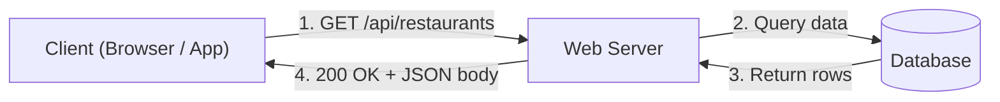

# HTTP (Hypertext Transfer Protocol)

> The standard protocol that clients and servers use to exchange data over the web.

Difficulty: 🟢 Beginner
Time: 12 min
Prerequisites:
- None (this is a foundational concept)

---

## Definition

HTTP is a request-response protocol that defines how clients (browsers, mobile apps, CLI tools) ask servers for data and how servers send it back. It gives every participant on the web a shared language — a standard set of verbs, headers, and status codes — so any client can talk to any server regardless of programming language or platform.

---

## Why it Exists

Before HTTP, there was no universal way for programs running on different machines to request and exchange documents over a network. Every system invented its own communication format.

HTTP solved this by creating a single, text-based protocol that any device could implement. Without it, your browser couldn't load a webpage, your phone couldn't call a backend API, and services couldn't talk to each other across the internet.

---

## Intuition

Think of HTTP like ordering at a restaurant counter.

You walk up and say: "I'd like the chicken sandwich" — that's your **request**. It has a specific format: what you want (the resource), how you want it (any modifications), and who you are (your table number).

The kitchen prepares it and hands it back with a status: "Here's your sandwich" (200 OK) or "We're out of chicken" (404 Not Found). That's the **response**.

You don't stay connected to the kitchen between orders. Each order is independent. That's what **stateless** means — the kitchen doesn't remember your last order unless you hand them a loyalty card (a cookie or token).

---

## Engineering Story

A mobile engineer is building a food delivery app. When the user opens the app, it needs to show nearby restaurants. The app sends an HTTP GET request to `GET /api/restaurants?lat=40.7&lng=-74.0`. The server looks up restaurants near those coordinates, and responds with a JSON array and a `200 OK` status.

When the user taps "Place Order," the app sends `POST /api/orders` with the cart items in the request body. The server creates the order, stores it in the database, and returns `201 Created` with the order ID.

If the user's session has expired, the server returns `401 Unauthorized`, and the app redirects to the login screen.

Every interaction — fetching data, submitting forms, uploading images, checking auth — follows the same request-response pattern. That's HTTP at work.

---

## How it Works

1. **Client builds a request.** It picks an HTTP method (GET, POST, PUT, DELETE), a URL path, headers (like `Content-Type: application/json`), and optionally a body.

2. **DNS resolves the hostname.** The domain (e.g., `api.example.com`) is translated into an IP address so the client knows which server to talk to.

3. **A TCP connection is established.** The client and server complete a TCP handshake (and a TLS handshake if using HTTPS) to create a reliable communication channel.

4. **Client sends the request.** The full HTTP message — method, path, headers, and body — travels over the connection to the server.

5. **Server processes the request.** The server reads the method and path, runs application logic (query a database, validate input, call another service), and builds a response.

6. **Server sends the response.** The response includes a status code (like `200 OK` or `500 Internal Server Error`), response headers, and a body (usually JSON or HTML).

7. **Client reads the response.** The client parses the status code to decide what to do next — render data, show an error, retry, or redirect.

---

## Key Concepts

### HTTP Methods

| Method | Purpose | Has Body? | Idempotent? |
|--------|---------|-----------|-------------|
| GET | Read a resource | No | Yes |
| POST | Create a resource | Yes | No |
| PUT | Replace a resource entirely | Yes | Yes |
| PATCH | Update part of a resource | Yes | No |
| DELETE | Remove a resource | Rarely | Yes |

**Idempotent** means calling it multiple times produces the same result as calling it once. GET the same URL ten times, you get the same page. POST a payment ten times, you might get ten charges — that's why POST is not idempotent.

### Status Codes

Status codes tell the client what happened. You don't need to memorize all of them, but knowing the categories is essential:

- **2xx — Success.** The request worked. `200 OK`, `201 Created`, `204 No Content`.
- **3xx — Redirect.** The resource moved. `301 Moved Permanently`, `304 Not Modified`.
- **4xx — Client error.** The client did something wrong. `400 Bad Request`, `401 Unauthorized`, `403 Forbidden`, `404 Not Found`, `429 Too Many Requests`.
- **5xx — Server error.** The server failed. `500 Internal Server Error`, `502 Bad Gateway`, `503 Service Unavailable`.

### Headers

Headers carry metadata about the request or response. A few you'll see constantly:

- `Content-Type`: What format the body is in (`application/json`, `text/html`).
- `Authorization`: Credentials for authenticated requests (`Bearer <token>`).
- `Cache-Control`: How long a response can be cached.
- `User-Agent`: Identifies the client (browser, mobile app, curl).

---

## Diagram



---

## Code Example

A minimal HTTP server and the request it handles:

```python
# server.py — a simple HTTP API endpoint
from http.server import HTTPServer, BaseHTTPRequestHandler
import json

class Handler(BaseHTTPRequestHandler):
    def do_GET(self):
        if self.path == "/api/user":
            self.send_response(200)
            self.send_header("Content-Type", "application/json")
            self.end_headers()

            user = {"id": "usr_42", "name": "Jane"}
            self.wfile.write(json.dumps(user).encode())
        else:
            self.send_response(404)
            self.end_headers()

HTTPServer(("", 8080), Handler).serve_forever()
```

```bash
# Making a request with curl
curl -X GET http://localhost:8080/api/user \
  -H "Accept: application/json"

# Response:
# HTTP/1.1 200 OK
# Content-Type: application/json
# {"id": "usr_42", "name": "Jane"}
```

The code shows the full cycle: the client sends a method and path, the server matches it, and returns a status code with data. That's the entire protocol in action.

---

## Advantages

- **Universal.** Every language, framework, and platform speaks HTTP. Your Python backend can serve a Swift iOS app, a React frontend, and a Go microservice — all over HTTP.
- **Human-readable.** Unlike binary protocols, you can read an HTTP request in plain text. This makes debugging straightforward with tools like curl, Postman, or browser DevTools.
- **Stateless.** Each request is independent. The server doesn't need to remember previous requests. This makes it easy to scale horizontally — any server in a pool can handle any request.
- **Flexible.** HTTP can carry any data format: JSON, HTML, XML, images, video streams, binary files.

---

## Limitations

- **Statelessness is a double-edged sword.** Since HTTP forgets everything between requests, you need cookies, tokens, or sessions to maintain user state. This adds complexity.
- **Header overhead.** Every request carries headers, even when the same client talks to the same server repeatedly. HTTP/1.1 sends these as uncompressed text, which adds up on high-traffic APIs.
- **One direction only.** HTTP is client-initiated. The server can't push data to the client without the client asking first. For real-time features (chat, live scores), you need WebSockets or Server-Sent Events.
- **Head-of-line blocking (HTTP/1.1).** In HTTP/1.1, requests on a connection are processed in order. A slow response blocks everything behind it.

---

## Tradeoffs

### HTTP/1.1 vs HTTP/2
HTTP/1.1 is simple and widely supported, but it sends headers as uncompressed text and processes requests sequentially on each connection. HTTP/2 compresses headers and multiplexes many requests over a single TCP connection, which is faster for pages that load many resources at once. The tradeoff: HTTP/2 is more complex to debug since traffic is binary, not plain text.

### HTTP vs WebSockets
HTTP works in request-response pairs — the client always initiates. WebSockets open a persistent, bidirectional connection where either side can send data at any time. Use HTTP for standard APIs and page loads. Use WebSockets when you need real-time, server-pushed updates like chat messages or live dashboards.

### REST over HTTP vs gRPC
REST uses standard HTTP verbs and JSON, which is easy to understand and debug. gRPC uses HTTP/2 with Protocol Buffers (binary serialization), which is faster and more bandwidth-efficient but harder to inspect. REST is the default choice for public APIs; gRPC fits high-performance service-to-service communication.

---

## Common Mistakes

- **Using GET for actions that change data.** GET should be safe and idempotent — it should never create, update, or delete anything. If a crawler or prefetch follows your `GET /delete-account` link, bad things happen.
- **Ignoring status codes.** Returning `200 OK` with `{"error": "something broke"}` in the body defeats the purpose of status codes. Use `4xx` for client errors and `5xx` for server errors so clients, proxies, and monitoring tools can react correctly.
- **Not handling network failures.** HTTP requests travel over unreliable networks. If you don't handle timeouts, retries, and connection errors, your app will silently break when the network hiccups.
- **Sending sensitive data in URLs.** Query parameters appear in browser history, server logs, and proxy logs. Never put passwords, tokens, or personal data in the URL. Use headers or the request body instead.
- **Confusing 401 and 403.** `401 Unauthorized` means "I don't know who you are — please authenticate." `403 Forbidden` means "I know who you are, but you're not allowed to do this."

---

## Related Concepts

- **HTTPS** — HTTP encrypted with TLS. In practice, all production HTTP traffic should be HTTPS.
- **TCP** — The transport layer protocol HTTP runs on top of. TCP ensures reliable, ordered delivery.
- **REST** — An architectural style for designing APIs that uses HTTP methods and status codes as intended.
- **WebSockets** — A protocol for persistent, bidirectional communication when HTTP's request-response model isn't enough.
- **gRPC** — A high-performance RPC framework built on HTTP/2 using binary serialization.

---

## Interview Questions

- **What happens when you type a URL into a browser and press Enter?** (Tests understanding of DNS, TCP, TLS, HTTP request/response, and rendering.)
- **What's the difference between PUT and PATCH?** (PUT replaces the entire resource; PATCH updates specific fields.)
- **Why is GET idempotent but POST is not?** (Tests understanding of HTTP method semantics and safe operations.)
- **How does HTTP handle state if it's stateless?** (Cookies, session tokens, JWTs sent in headers.)
- **What's head-of-line blocking and how do HTTP/2 and HTTP/3 address it?** (Tests knowledge of protocol evolution and multiplexing.)

---

## TLDR

- HTTP is a request-response protocol — the client asks, the server answers.
- Methods (GET, POST, PUT, DELETE) express intent; status codes (2xx, 4xx, 5xx) express outcome.
- HTTP is stateless — each request is independent, which makes scaling simple.
- Headers carry metadata; the body carries data.
- HTTP/2 and HTTP/3 fix performance problems (header compression, multiplexing) while keeping the same semantics.
