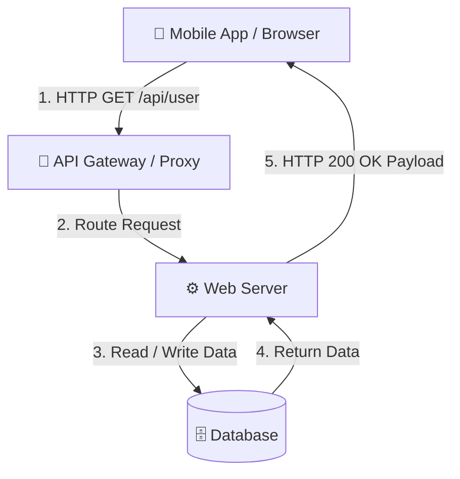

# HTTP (Hypertext Transfer Protocol)

## Definition
HTTP is the standard request-response protocol web browsers, mobile apps, and backend servers use to exchange data (JSON, HTML, media) over the internet.

---

## Why it Exists
- **What problem does it solve?** It creates a single universal language for fetching and sending data across different platforms and programming languages.
- **What happens without it?** Web browsers wouldn't be able to render pages, mobile apps couldn't query backend APIs, and CDNs or load balancers wouldn't know how to route network traffic.

---

## Intuition
Think of HTTP like sending a letter through the post office:
- **Envelope Headers**: Recipient address (URL), action requested (`GET` or `POST`), and return address.
- **Letter Inside**: Message payload (Body).
- **Reply**: Return envelope stamped with a status code (`200 OK` or `404 Not Found`).

---

## Engineering Story
At **Stripe** and **Netflix**, millions of API requests travel over HTTP every second. In 2015, Stripe noticed mobile apps suffered from slow load times over weak cellular networks because HTTP/1.1 processed requests one after another (*head-of-line blocking*). Upgrading edge proxies to HTTP/2 and HTTP/3 allowed multiple requests over a single connection simultaneously, reducing network latency by 35%.

---

## How it Works
1. **DNS Lookup**: Translates hostname (e.g., `api.stripe.com`) into an IP address.
2. **TCP/TLS Handshake**: Establishes a secure connection between client and server.
3. **Send Request**: Client sends verb (`GET`/`POST`), headers (`Content-Type`), and body payload.
4. **Server Process**: Server executes logic and queries database.
5. **Send Response**: Server returns HTTP status code (`200 OK`) and JSON data.

---

## Diagram



---

## Code Example

```go
package main

import (
	"encoding/json"
	"fmt"
	"net/http"
)

type User struct {
	ID   string `json:"id"`
	Name string `json:"name"`
}

func userHandler(w http.ResponseWriter, r *http.Request) {
	if r.Method != http.MethodGet {
		http.Error(w, "Method not allowed", http.StatusMethodNotAllowed)
		return
	}

	w.Header().Set("Content-Type", "application/json")
	json.NewEncoder(w).Encode(User{ID: "usr_100", Name: "Jane Doe"})
}

func main() {
	http.HandleFunc("/api/user", userHandler)
	fmt.Println("Server running on http://localhost:8080...")
	http.ListenAndServe(":8080", nil)
}
```

---

## Advantages & Limitations
- **Advantages**: Simple, human-readable, universal support, stateless for easy scaling.
- **Limitations**: Header overhead on every request; older HTTP/1.1 suffers from line blocking.

---

## Tradeoffs
- **HTTP/1.1 vs HTTP/2**: HTTP/1.1 sends plain text headers sequentially; HTTP/2 compresses headers and multiplexes requests over a single connection.
- **HTTP/2 vs HTTP/3**: HTTP/3 uses UDP (QUIC) instead of TCP, eliminating packet delay bottlenecks on unstable mobile networks.

---

## Related Concepts
- **HTTPS**: Encrypted HTTP using TLS.
- **gRPC**: High-performance binary RPC protocol built on HTTP/2.
- **REST**: API architecture using standard HTTP verbs and status codes.

---

## TLDR
- 1. HTTP is the universal request-response protocol for web and mobile APIs.
- 2. Uses standard verbs (`GET`, `POST`), headers, and status codes (`200`, `404`).
- 3. HTTP is stateless—each request carries its own context.
- 4. HTTP/2 and HTTP/3 multiplex multiple requests over a single connection for speed.
