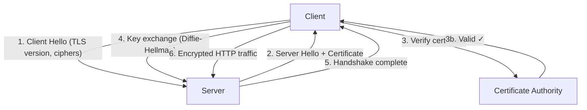

# HTTPS (Hypertext Transfer Protocol Secure)

> HTTP with an encryption layer that prevents anyone between client and server from reading or tampering with the data.

Difficulty: 🟡 Intermediate
Time: 12 min
Prerequisites:
- [HTTP](http.md)
- TCP (basic familiarity)

---

## Definition

HTTPS is HTTP running on top of TLS (Transport Layer Security), a cryptographic protocol that encrypts traffic between a client and server. It gives you three guarantees: the data is **private** (no one can read it), **intact** (no one can change it), and **authentic** (you're actually talking to the server you think you are).

---

## Why it Exists

Plain HTTP sends everything as readable text. Any router, ISP, or device sitting between you and the server can see your passwords, credit card numbers, cookies, and auth tokens — and modify the response before it arrives.

This isn't theoretical. On public Wi-Fi networks, attackers routinely intercept HTTP traffic in what are called **man-in-the-middle attacks**. Even on trusted networks, ISPs have injected ads into unencrypted pages.

HTTPS was designed to make eavesdropping and tampering cryptographically infeasible — regardless of which network you're on.

---

## Intuition

Think of plain HTTP like sending a postcard. Anyone who handles it — the mail carrier, the sorting facility — can read what's written and even write something extra on it.

HTTPS is like putting that postcard in a sealed, tamper-evident envelope. Before you seal it, you and the recipient agree on a secret key that only the two of you know. Even if someone intercepts the envelope, they can't open it without that key, and you'd know immediately if anyone had tried.

That key exchange is what the **TLS handshake** does before any HTTP data flows.

---

## Engineering Story

A user opens your banking app on airport Wi-Fi and taps "Transfer $500." Their device sends a request to `api.yourbank.com`.

Without HTTPS, every packet in that request travels as plain text. The attacker running a fake access point at the airport can read the amount, the destination account, and the session token — and can silently modify the amount to $5,000 before it reaches the bank's server. The bank would never know.

With HTTPS, the request is encrypted with keys only the app and the real bank server possess. The attacker intercepts gibberish they can't read or meaningfully modify. The bank also proves it's the real bank through its certificate — the attacker can't fake that without a private key the bank controls.

---

## How it Works

HTTPS = HTTP + TLS. The HTTP layer is unchanged. TLS handles encryption below it.

Before data flows, the client and server perform a **TLS handshake**:

1. **Client Hello.** The client connects to the server on port 443 and announces: the TLS version it supports, a list of cipher suites it knows, and a random value.

2. **Server Hello.** The server picks a cipher suite, sends its **TLS certificate** (issued by a Certificate Authority), and its own random value.

3. **Certificate verification.** The client checks the certificate:
   - Is it signed by a trusted Certificate Authority (CA)?
   - Does the domain match?
   - Has it expired?

   If any check fails, the browser shows a security warning and stops.

4. **Key exchange.** Using the certificate's public key, the client and server agree on a shared **session key** without ever sending it over the wire. Modern TLS uses Diffie-Hellman key exchange to accomplish this.

5. **Handshake complete.** Both sides derive the same symmetric encryption key from the exchange. All subsequent HTTP traffic is encrypted with it.

6. **Encrypted HTTP.** From here, every request and response looks like regular HTTP — methods, headers, status codes, bodies — but all of it is encrypted. To anyone observing the network, it's indecipherable.

---

## Diagram



---

## Key Concepts

### TLS Certificates

A certificate is a digital document that says: "I am `api.example.com` and this is my public key." It's signed by a **Certificate Authority (CA)** — a trusted third party like Let's Encrypt, DigiCert, or Comodo — whose root certificate is pre-installed in your operating system and browsers.

When you see a padlock icon, it means the server's certificate passed verification.

### Cipher Suites

A cipher suite is a combination of algorithms for key exchange, authentication, encryption, and message integrity. Example:

`TLS_AES_128_GCM_SHA256`

- `AES_128_GCM` — the symmetric encryption algorithm
- `SHA256` — the hashing algorithm for message integrity

Servers and clients negotiate which suite to use during the handshake.

### Symmetric vs Asymmetric Encryption

The TLS handshake uses **asymmetric** encryption (public/private key pairs) to safely agree on a shared secret. After that, **symmetric** encryption handles all actual data — it's orders of magnitude faster.

---

## Advantages

- **Privacy.** Traffic is encrypted end to end. ISPs, attackers, and network appliances can't read the data.
- **Integrity.** Any tampering with packets in transit is detected and causes the connection to fail.
- **Authentication.** Certificates prove you're talking to the real server, not an impersonator.
- **SEO and trust signals.** Browsers mark HTTP sites as "Not Secure." Google ranks HTTPS sites higher. Users trust the padlock icon.
- **Required for modern features.** Service Workers, HTTP/2, and most browser APIs require HTTPS.

---

## Limitations

- **Certificates require ongoing management.** Certificates expire (every 90 days for Let's Encrypt). Failing to renew causes an immediate outage — every client connection to that domain fails.
- **TLS adds latency.** The handshake takes extra round trips before the first byte of HTTP data flows. TLS 1.3 reduced this to one round trip, but it's still non-zero overhead.
- **HTTPS encrypts transport, not the endpoints.** If the server is compromised, HTTPS doesn't protect your data at rest. If the client's device has malware, HTTPS doesn't help either.
- **Certificate Authorities are a trust bottleneck.** If a CA is compromised, attackers can issue fraudulent certificates. Certificate Transparency logs exist to detect this, but the CA model is a centralized point of trust.

---

## Tradeoffs

### TLS 1.2 vs TLS 1.3

TLS 1.3 (2018) is faster and more secure than 1.2. It requires only **one round trip** for the handshake (vs two in 1.2) and removes weak, legacy cipher suites. If you're supporting modern traffic, prefer 1.3. Retain 1.2 only for backward compatibility with legacy clients.

### The TLS performance question

TLS handshakes have overhead, but it's often overstated. Connections are reused via TLS session resumption, and HTTP/2 (which requires HTTPS in practice) more than compensates with multiplexing and header compression. Modern HTTPS + HTTP/2 is often **faster** than plain HTTP/1.1 for typical web traffic.

### Self-signed vs CA-signed certificates

Self-signed certificates are free and instant to generate, but browsers reject them with security warnings — they prove nothing about identity. Use them only in development or internal services where you control the clients and can install your own root CA. Use CA-signed certificates in production.

---

## Common Mistakes

- **Mixed content.** Serving a page over HTTPS but loading scripts, images, or API calls over HTTP. Browsers block or warn about this — and those HTTP resources undermine the security of the whole page.
- **Letting certificates expire.** Certificate expiry causes immediate, total outages. Every team operating HTTPS in production needs automated renewal (e.g., certbot with Let's Encrypt) and monitoring on expiry dates.
- **Assuming HTTPS = fully secure.** HTTPS secures the wire. It says nothing about your authentication logic, database security, or access control bugs in your API.
- **Incorrect certificate pinning in mobile apps.** Hardcoding an expected certificate (pinning) can prevent MITM attacks, but will break your app the moment you rotate your certificate — unless you update the pin in advance.
- **Leaving weak cipher suites enabled.** Old TLS configurations support broken algorithms like RC4 or export-grade ciphers. Use a tool like SSL Labs to audit your configuration.

---

## Related Concepts

- **[HTTP](http.md)** — The protocol HTTPS secures. Understanding HTTP is a prerequisite.
- **TLS** — The cryptographic layer that provides the "S" in HTTPS. Worth understanding independently.
- **DNS** — HTTPS doesn't protect DNS lookups by default. DNS-over-HTTPS (DoH) addresses this.
- **Certificates / PKI** — The Public Key Infrastructure that issues and validates TLS certificates.

---

## What to Learn Next

```
HTTP
↓
HTTPS  ← you are here
↓
TLS (in depth)
↓
Certificate Authorities & PKI
```

---

## Interview Questions

- **What's the difference between HTTP and HTTPS?** (Encryption, authentication, integrity via TLS — not just a padlock.)
- **What happens during a TLS handshake?** (Client hello, server certificate, key exchange, session keys established, then encrypted traffic.)
- **What does a TLS certificate prove?** (That the server owns the private key for the certificate's public key, and that a trusted CA has signed it for that domain.)
- **Why is HTTPS important even for public, read-only websites?** (Integrity — attackers can inject content into unencrypted responses. Also required for modern browser features.)
- **What's the difference between symmetric and asymmetric encryption, and why does TLS use both?** (Asymmetric for key exchange — no pre-shared secret needed. Symmetric for data — far faster.)

---

## TLDR

- HTTPS is HTTP + TLS: the same protocol, with all traffic encrypted.
- The TLS handshake authenticates the server and establishes a shared encryption key before any data flows.
- Certificates, issued by Certificate Authorities, prove you're talking to the right server.
- HTTPS secures the wire — it doesn't secure your endpoints, databases, or application logic.
- Let certificates expire and you get instant downtime; automate renewal in production.
