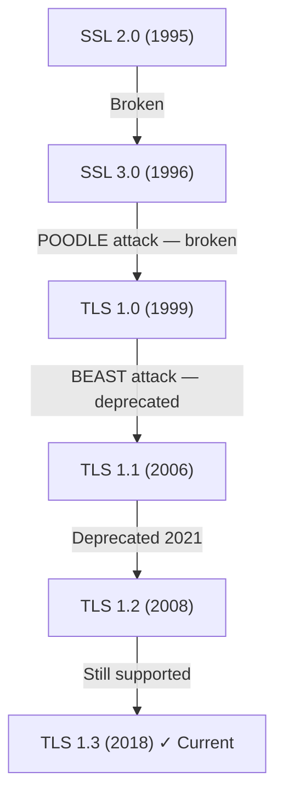

# SSL (Secure Sockets Layer)

> The original protocol for encrypting network traffic — now deprecated, but still the word most engineers say when they mean TLS.

Difficulty: 🟡 Intermediate
Time: 10 min
Prerequisites:
- [HTTP](../networking/http.md)
- [HTTPS](../networking/https.md)

---

## Definition

SSL is a cryptographic protocol developed in the 1990s to encrypt data sent between a client and a server. It was succeeded by TLS (Transport Layer Security) and all versions of SSL are now considered broken and disabled — but the word "SSL" lives on as a colloquial shorthand for the encryption technology underpinning HTTPS.

---

## Why it Exists

In the early web, HTTP sent everything as plain text. Netscape needed a way to secure credit card transactions on their browser. They designed SSL in 1994 to add an encryption layer between HTTP and TCP — so that data travelling over the wire couldn't be read or modified by anyone in between.

It worked well enough to become the foundation of secure internet commerce. But as cryptography evolved, SSL's designs revealed serious weaknesses. It was patched, redesigned, and ultimately replaced — first by TLS 1.0 in 1999, then by progressively stronger versions.

---

## Intuition

Think of SSL and TLS as different generations of the same lock design.

SSL was the original deadbolt — it worked, but locksmiths later discovered flaws in how it was manufactured. TLS is the improved version, built with better materials and techniques. Your bank still calls it "SSL-secured" on its website, but the actual lock on the door is TLS.

The name stuck because engineers are lazy with words that work. "TLS certificate," "SSL certificate" — both refer to the same thing. What matters is the version running underneath.

---

## Engineering Story

A fintech company's security team runs a quarterly audit of their API infrastructure. Their scanner flags two findings:

1. **SSLv3 is still enabled on one of their internal load balancers.** This opens the door to POODLE — a 2014 attack that can decrypt SSLv3 traffic by exploiting a flaw in how it handles padding. The fix is one config line: disable SSLv3.

2. **Their certificate vendor's dashboard says "SSL Certificate" but the cert is configured for TLS 1.2 and TLS 1.3.** The word "SSL" is just the vendor's branding. The underlying protocol is fine.

Both findings are about "SSL" — but only the first one is actually dangerous. Understanding the distinction between the word and the protocol matters when you're reading security reports.

---

## How it Works

SSL and TLS follow the same fundamental model — a handshake to establish a secure channel, then encrypted data exchange. The mechanics are covered in detail in [HTTPS](../networking/https.md). What's useful here is understanding the version history and why each version fell.

### SSL Version History

| Version | Year | Status | Why it Fell |
|---------|------|--------|-------------|
| SSL 1.0 | 1994 | Never released | Serious flaws found before shipping |
| SSL 2.0 | 1995 | Disabled (RFC 6176) | Weak MAC, susceptible to downgrade attacks |
| SSL 3.0 | 1996 | Disabled (RFC 7568) | POODLE attack (2014) — fundamentally broken padding |
| TLS 1.0 | 1999 | Deprecated (2021) | BEAST attack, falls short of modern standards |
| TLS 1.1 | 2006 | Deprecated (2021) | Weak cipher suites, phased out with 1.0 |
| TLS 1.2 | 2008 | Still supported | Secure when configured correctly |
| TLS 1.3 | 2018 | Current standard | Faster, stronger, removes all legacy cruft |

**The practical takeaway:** If you see "SSL" in your server configuration, it means you have a problem. All SSL versions are disabled in every major browser and should be disabled on your servers too.

---

## Diagram



---

## SSL vs TLS: Clearing Up the Terminology

This is the most practically useful thing to understand about SSL:

| Term | What Engineers Say | What They Mean |
|------|-------------------|----------------|
| "SSL certificate" | Everywhere | TLS certificate (X.509 cert used by TLS) |
| "SSL handshake" | Common | TLS handshake |
| "Enable SSL" | DevOps configs | Configure TLS (1.2 or 1.3) |
| "SSL Labs score" | Security audits | A TLS configuration rating tool |
| Actual SSL | Security alert | Something is misconfigured and dangerous |

Certificates themselves have nothing inherently to do with SSL vs TLS. An X.509 certificate works with TLS 1.2 and TLS 1.3 alike. The certificate type (RSA vs ECDSA) and the TLS version are separate configuration choices.

---

## Advantages

SSL introduced the concepts that still underpin internet security today:

- **End-to-end encryption** for HTTP — the foundation of every secure transaction online.
- **Server authentication** via certificates — the CA model used in modern TLS originates here.
- **Layered design** — encrypting above TCP meant any application protocol (HTTP, SMTP, FTP) could become secure without changing the underlying network.

These ideas survived. The implementation did not.

---

## Limitations

- **All SSL versions are broken.** SSLv2 and SSLv3 have published, weaponized exploits. There is no secure configuration of SSL. It should never appear on a production system.
- **The naming confusion is a real operational risk.** Engineers disable "SSL" in config files thinking they've tightened security, without realizing they've left TLS 1.0 and 1.1 active. Check protocol-level settings, not just the labels.
- **TLS 1.0 and 1.1, though not "SSL," are also deprecated.** PCI-DSS compliance requires TLS 1.2 minimum. Most security frameworks require it.

---

## Common Mistakes

- **Leaving SSLv3 enabled "for compatibility."** There are no modern clients that require SSLv3. Anything claiming to need it is either misconfigured or itself a vulnerability. Disable it.
- **Treating "SSL certificate" as meaningful terminology.** Certificates don't have a protocol version. You configure the TLS version separately from the certificate type. Don't let the naming confuse your architecture decisions.
- **Using TLS 1.0 as a fallback for "old clients."** Old enough to need TLS 1.0 means old enough to be a security risk in other ways. The correct solution is to upgrade, not to keep an insecure fallback.
- **Not auditing what protocols are actually enabled.** Your load balancer config may say "secure" while still advertising SSLv3 to connecting clients. Run `openssl s_client` or use SSL Labs to verify what your server actually negotiates.

```bash
# Check what protocols your server actually accepts
openssl s_client -connect yourdomain.com:443 -ssl3
# Should return: "ssl handshake failure" — if it succeeds, SSLv3 is enabled and dangerous

# Check TLS 1.3 support
openssl s_client -connect yourdomain.com:443 -tls1_3
# Should succeed on modern, correctly configured servers
```

---

## Related Concepts

- **[HTTPS](../networking/https.md)** — The application of TLS (formerly SSL) to HTTP. The practical context where most engineers encounter this.
- **TLS** — SSL's successor. When someone says "SSL," they mean TLS. Learn TLS 1.2 and TLS 1.3 in depth.
- **Certificates / X.509** — The certificate format used by both SSL and TLS for server authentication.
- **POODLE / BEAST / CRIME** — The named attacks that killed SSL and early TLS versions. Worth knowing the names for security discussions.

---

## What to Learn Next

```
HTTP
↓
HTTPS
↓
SSL  ← you are here
↓
TLS (in depth — 1.2 vs 1.3, cipher suites, session resumption)
↓
Certificate Authorities & PKI
```

---

## Interview Questions

- **What's the difference between SSL and TLS?** (SSL is the deprecated predecessor. TLS is the modern protocol. They're the same concept, different versions — all SSL versions are broken.)
- **Is an "SSL certificate" different from a "TLS certificate?"** (No. Certificates are X.509 documents used by both. The terminology is just colloquial.)
- **Why is SSLv3 dangerous?** (POODLE attack — a padding oracle vulnerability allows an attacker to decrypt SSL 3.0 traffic in a downgrade attack.)
- **What TLS versions should a production server support in 2024?** (TLS 1.2 minimum, TLS 1.3 preferred. Disable TLS 1.0, TLS 1.1, and all SSL versions.)
- **How would you verify which TLS versions your server accepts?** (`openssl s_client`, SSL Labs, nmap, or testssl.sh.)

---

## TLDR

- SSL is the deprecated ancestor of TLS — all SSL versions (2.0, 3.0) are cryptographically broken.
- When engineers say "SSL," they almost always mean TLS. Certificates, handshakes, "SSL Labs" — all TLS.
- Never enable SSLv3 on a production server; it is vulnerable to the POODLE attack.
- TLS 1.2 is the minimum for compliance; TLS 1.3 is the current best practice.
- The word "SSL" stuck in the industry vocabulary; the protocol itself should never appear in your infrastructure.
