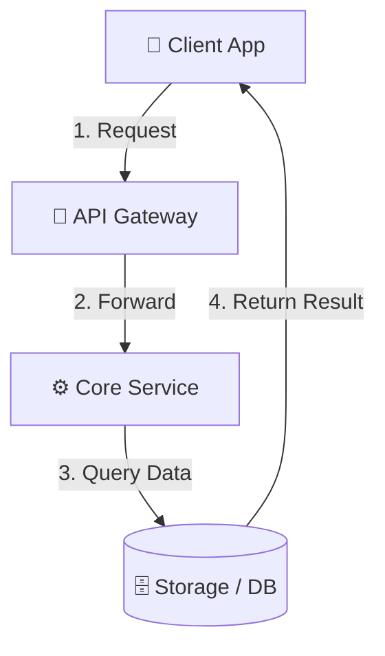

# Title

## Definition
[1-2 clear, simple sentences explaining what it is.]

---

## Why it Exists
- **What problem does it solve?**
- **What happens without it?**

---

## Intuition
[Simple daily-life analogy.]

---

## Engineering Story
[Real-world scenario at scale (e.g. Netflix, Stripe, Uber, WhatsApp).]

---

## How it Works
[Step-by-step logical breakdown of how it operates.]

---

## Diagram



---

## Code Example *(Only include if code adds direct value)*

```go
// Clean, minimal code snippet
```

---

## Advantages & Limitations
- **Advantages**: 
- **Limitations**: 

---

## Tradeoffs *(Include if relevant)*

---

## Common Mistakes *(Include if relevant)*

---

## Related Concepts
- **[Related Concept](../other-category/related.md)**: [Short description]

---

## Interview Questions *(Include if relevant)*

### Junior / Mid
- **Q**: 
  - **Key Points**: 

---

## TLDR
- 1. [Key takeaway 1]
- 2. [Key takeaway 2]
- 3. [Key takeaway 3]
